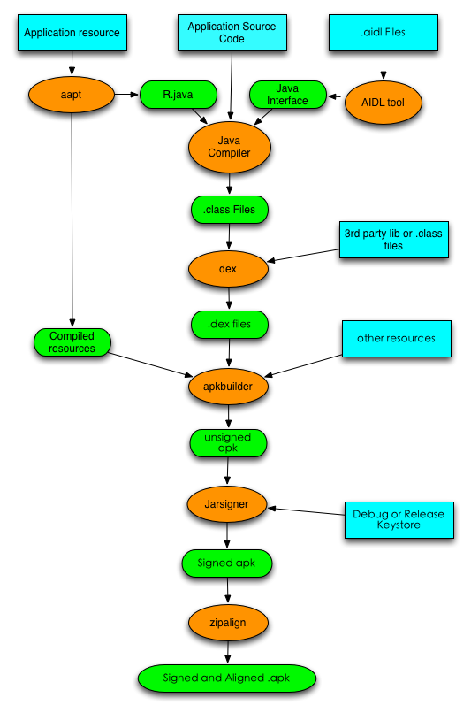

## 一. Android打包流程图

## 二. 打包步骤说明

### 第一步：打包资源文件，生成R.java文件
输入|输出|工具
----|----|----
1. Resource文件（就是工程中res中的文件） 2. Assets文件（相当于另外一种资源，这种资源Android系统并不像对res中的文件那样优化它） 3. AndroidManifest.xml文件（包名就是从这里读取的，因为生成R.java文件需要包名） 4. Android基础类库（Android.jar文件）| 1. 打包好的资源（一般在Android工程的bin目录可以看到一个叫resources.ap_的文件就是它了） 2. R.java文件（在gen目录中）|aapt

### 第二步：处理AIDL文件，生成对应的.java文件
输入|输出|工具
----|----|----
源码文件、aidl文件、framework.aidl文件|对应的.java文件|aidl

说明:有很多工程没有用到AIDL，那这个过程就可以省了

### 第三步：编译Java文件，生成对应的.class文件

输入|输出|工具
----|----|----
源码文件（包括R.java和AIDL生成的.java文件）、库文件（.jar文件）|.class文件|javac

### 第四步：把.class文件转化成Davik VM支持的.dex文件

输入|输出|工具
----|----|----
.class文件（包括Aidl生成.class文件，R生成的.class文件，源文件生成的.class文件），库文件（.jar文件）|.dex文件|javac

### 第五步：打包生成未签名的.apk文件

输入|输出|工具
----|----|----
1.打包后的资源文件 2.打包后类文件（.dex文件） 3.libs文件（包括.so文件，当然很多工程都没有这样的文件，如果你不使用C/C++开发的话）|未签名的.apk文件|apkbuilder

### 第六步：对未签名.apk文件进行签名

输入|输出|工具
----|----|----
未签名的.apk文件|签名的.apk文件|jarsigner

### 第七步：对签名后的.apk文件进行对齐处理

输入|输出|工具
----|----|----
签名后的.apk文件|对齐后的.apk文件|zipalign工具

说明:不进行对齐处理是不能发布到Google Market的

## 三. 打包过程中用到的工具:

名称|功能介绍|在操作系统中的路径
----|----|----
aapt|Android资源打包工具|${ANDROID_SDK_HOME}/platform-tools/appt 
aidl|Android接口描述语言转化为.java文件的工具|${ANDROID_SDK_HOME}/platform-tools/aidl
javac|Java Compiler|${JDK_HOME}/javac或/usr/bin/javac
dex|转化.class文件为Davik VM能识别的.dex文件| ${ANDROID_SDK_HOME}/platform-tools/dx
apkbuilder|生成apk包|${ANDROID_SDK_HOME}/tools/opkbuilder
jarsigner|.jar文件的签名工具|${JDK_HOME}/jarsigner或/usr/bin/jarsigner
zipalign|字节码对齐工具|${ANDROID_SDK_HOME}/tools/zipalign

