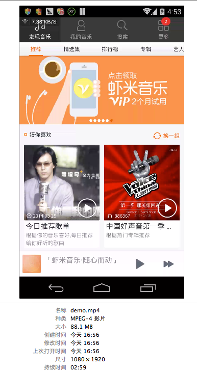

# Android视频录制命令screenrecord

## 你要知道:
* screenrecord是一个shell命令
* 支持Android4.4(API level 19)以上
* 支持视频格式: mp4

## 一些限制

* 某些设备可能无法直接录制,原因是分辨率太高,如果遇到此类问题，请试着指定较低的分辨率
* 不支持录制过程中屏幕旋转,如果录制过程中旋转，有可能画面被切断
* 录制视频的时候声音不会被录下来


## 开始录制命令:

```
adb shell screenrecord /sdcard/demo.mp4
```

说明:录制手机屏幕,视频格式为mp4,存放到手机sd卡里，默认录制时间为180s

## 限制录制时间:

参数: --time-limit<TIME>

```
adb shell screenrecord  --time-limit 10 /sdcard/demo.mp4
```

说明:限制视频录制时间为10s,如果不限制,默认180s

## 指定视频分辨率大小：


参数: --size <WIDTHxHEIGHT>

```
adb shell screenrecord --size 1280*720 /sdcard/demo.mp4
```

说明:录制视频，分辨率为1280*720，如果不指定默认使用手机的分辨率,为获得最佳效果，请使用设备上的高级视频编码（AVC）支持的大小

##指定视频的比特率

参数: --bit-rate <RATE>

```
adb shell screenrecord --bit-rate 6000000 /sdcard/demo.mp4
```

说明:指定视频的比特率为6Mbps,如果不指定,默认为4Mbps. 你可以增加比特率以提高视频质量或为了让文件更小而降低比特率

## 在命令行显示log


参数: --verbose


```
bixiaopeng@bixiaopeng wirelessqa$ adb shell screenrecord --time-limit 10 --verbose /sdcard/demo.mp4
Main display is 1080x1920 @60.00fps (orientation=0)
Configuring recorder for 1080x1920 video at 4.00Mbps
Content area is 1080x1920 at offset x=0 y=0
Time limit reached
Encoder stopping; recorded 96 frames in 10 seconds
Stopping encoder and muxer
Executing: /system/bin/am broadcast -a android.intent.action.MEDIA_SCANNER_SCAN_FILE -d file:///sdcard/demo.mp4

Broadcasting: Intent { act=android.intent.action.MEDIA_SCANNER_SCAN_FILE dat=file:///sdcard/demo.mp4 }
Broadcast completed: result=0
```

## 旋转90度

参数: --rotate

说明:此功能为实验性的，好不好用不知道

## 查看帮助命令
参数: --help

```
bixiaopeng@bixiaopeng ~$ adb shell screenrecord --help
Usage: screenrecord [options] <filename>

Records the device's display to a .mp4 file.

Options:
--size WIDTHxHEIGHT
    Set the video size, e.g. "1280x720".  Default is the device's main
    display resolution (if supported), 1280x720 if not.  For best results,
    use a size supported by the AVC encoder.
--bit-rate RATE
    Set the video bit rate, in megabits per second.  Default 4Mbps.
--time-limit TIME
    Set the maximum recording time, in seconds.  Default / maximum is 180.
--rotate
    Rotate the output 90 degrees.
--verbose
    Display interesting information on stdout.
--help
    Show this message.

Recording continues until Ctrl-C is hit or the time limit is reached.

```

## 导出视频：

```
adb pull /sdcard/demo.mp4
```

说明:导出视频到当前目录



----
####  微信公众帐号: wirelessqa 


#### 关于作者：

**作者:** 毕小朋 | 老 毕  **邮箱:** <wirelessqa.me@gmail.com> 

**微博:** [@WirelessQA](http://www.weibo.com/wirelessqa) **博客:** <http://blog.csdn.net/wirelessqa>

----