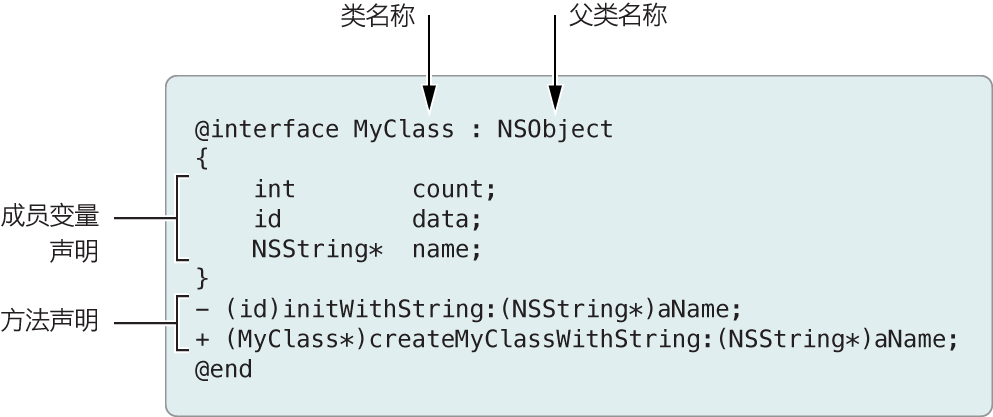

## 1. 基础介绍

Objective-C 中某个类的规格需要两个不同的部分：接口和实现。接口部分包含类声明，并定义该类的公共接口。


```
.h :头文件。头文件包含类、类型、函数和常量声明。
.m :实现文件。具有此扩展名的文件可以同时包含 Objective-C代码和C代码。有时也称为源文件。
```


### 1.1 类接口语法

```
1.类声明以编译器指令 @interface 开始，以 @end 指令结束。
2. 类名称后面（以冒号分隔），是父类的名称。在 Objective-C 中，一个类只能有一个父类。
3.在 @interface 指令和 @end 指令之间，编写属性和方法的声明。这些声明组成了类的公共接口。
4.分号标记每个属性和方法声明的结尾。
5.如果类具有与其公共接口相关的自定函数、常量或数据类型，请将它们的声明放在@interface ...@end 块之外。
```

例：下列框图中的语法声明名为 MyClass 的类，它是从基础类（或根类）NSObject 继承而来的。（根类是供其他类直接或间接继承的类。）


### 1.2 方法修饰符 

```
- 代表此方法是实体方法，必须先生成类实例，通过实例才能调用该方法。
+ 代表此方法是类的静态方法，可以直接调用，而不用生成类实例。

```
### 1.3 类实现的语法

```
1. 类实现以 @implementation 编译器指令开始（接着是该类的名称），以 @end 指令结束。中间是方法实现。（函数实现应在 @implementation ...@end 块之外。）
2. 一个实现应该总是将导入它的接口文件作为代码的第一行。
```


### 1.4 类型化变量说明

对于包含对象的变量，Objective-C 既支持动态类型化，也支持静态类型化。

下面的例子，展示了静态类型化和动态类型化的变量声明：

```
MyClass *myObject1;  // 静态类型    
id myObject2;  // 动态类型
NSString *userName;  // 静态类型
```

1. 静态类型化的变量，要在变量类型声明中包括类名称。例：MyClass *myObject1;

	说明：在静态类型化的对象的声明中，变量的名称前面应放置一个星号

2. 动态类型化的变量，则要给对象使用类型 id。例: id myObject2;

	说明：id 类型意味着一个指针，在 Objective-C 中，执行对象引用的只能是指针。

### 1.5 什么时候需要使用动态类型化变量？

动态类型化变量提供了极大的灵活性，也让 Objective-C 程序拥有了更强大的活力,所以像：集 (collection) 对象、数组，在它包含对象的类型未知的情况下，可能会使用动态类型化的变量。

## 2. 码上开始

```
//
//  Arithmetic.h
//  test1
//
//  Created by bixiaopeng on 13-10-10.
//  Copyright (c) 2013年 bixiaopeng. All rights reserved.
//

#import <Foundation/Foundation.h>

//1.@interface用于描述类、类的声明及方法
//2.NSObject为Arithmetic的父类，必须要命名的
@interface Arithmetic : NSObject
{
    //3.声明两个整型的实例变量,在@implementation中赋值后可以直接使用
    int numA;
    int numB;
    /*
     4.命名规范：类名以大写字母开始，实例变量、对象和方法通常以小写字母开始。
     */
}
//5.void 声明实例方法,无返回值，无参数
- (void) print;
//6. 声明实例方法,无返回值，有一个整形的参数
- (void) setA: (int) a;
- (void) setB: (int) b;
//7.声明实例方法,返回一个整形的值，无参数
- (int) sum;
@end


```

```
//
//  Arithmetic.m
//  test1
//
//  Created by bixiaopeng on 13-10-10.
//  Copyright (c) 2013年 bixiaopeng. All rights reserved.
//

#import "Arithmetic.h"

//1. @implementation用于实现@interface中声明的方法
@implementation Arithmetic

//2.这里实现的方法，需要对应@interface中声明的方法
- (void) print
{
    NSLog(@"numA is %i and numB is %i",numA,numB);
}

- (void) setA: (int) a
{
    //3.接收传入的参数a,并赋值给numA,numA这个实例变量在@interface有声明过。
    numA = a;
    NSLog(@"numA is:%i",numA);
}
- (void) setB: (int) b
{
    numB = b;
    NSLog(@"numB is:%i",numB);
    
}

- (int) sum
{
    //4.返回一个整型的值
    return numA+numB;
}

@end
```

```
//
//  main.m
//  test1
//
//  Created by bixiaopeng on 13-10-9.
//  Copyright (c) 2013年 bixiaopeng. All rights reserved.
//

#import <Foundation/Foundation.h>
#import "Arithmetic.h" //1.import下面代码需要用到的类
int main(int argc, const char * argv[])

{
    
    @autoreleasepool {
        // Arithmetic *arithmetic; 声明对象
        // arithmetic = [[Arithmetic alloc] init]; 为对象分配内存空间alloc，然后初始化init
        // 以上可步可以简写成下面这个： Arithmetic *arithmetic = [[Arithmetic alloc] init];
        //2.给对象分配内存空间，然后初始化对象
        Arithmetic *arithmetic = [[Arithmetic alloc] init];
        [arithmetic setA:2]; //3.调用Arithmetic类中的方法setA,并传入参数2
        [arithmetic setB:5]; //调用Arithmetic类中的方法setB,并传入参数5
        [arithmetic print];//4.调用Arithmetic类中的方法print,没有参数
        int ssum = [arithmetic sum];//5.调用Arithmetic类中的方法sum,返回值为整型
        NSLog(@"ssum is %i",ssum);//打印log
        
    }
    return 0;

}
```

----
####  微信公众帐号: wirelessqa 


#### 关于作者：

**作者:** 毕小朋 | 老 毕  **邮箱:** <wirelessqa.me@gmail.com> 

**微博:** [@WirelessQA](http://www.weibo.com/wirelessqa) **博客:** <http://blog.csdn.net/wirelessqa>

----
