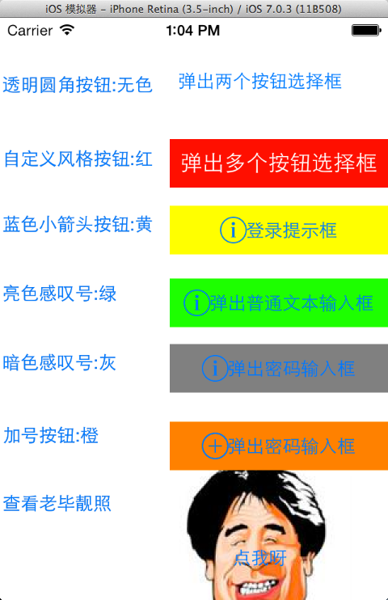
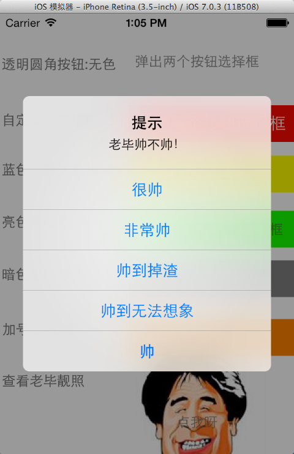
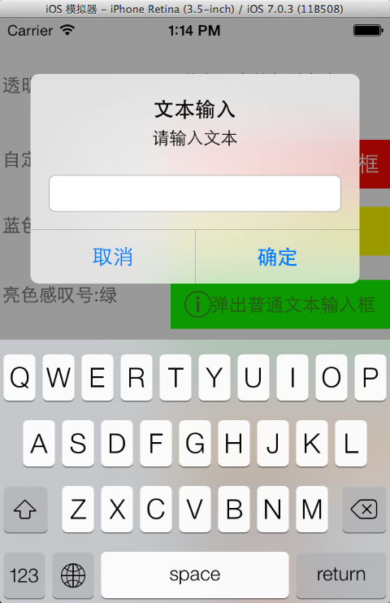
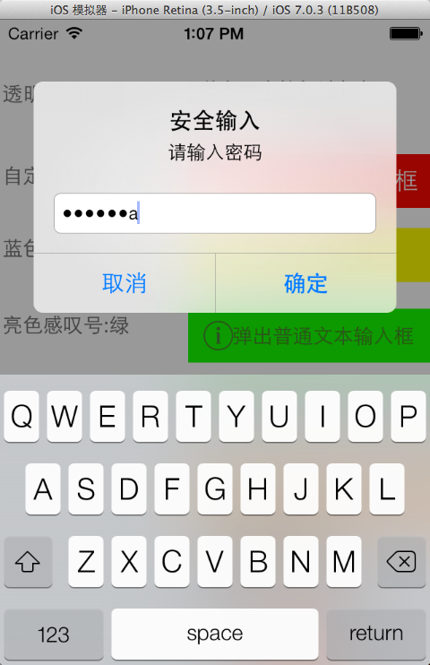

## 一. 动态添加Button和监听UIAlertView按钮

### 1.1 实例效果:

- 动态添加Button的效果就是点击之后，生成一个按钮，并为按钮添加点击的方法。


### 1.2 实现步骤:
```
1. Main.storyboard上拖拽添加一个button
2. 拖拽button到SimpleTableViewController.h生成IBAction
3. 动态生成的button点击事件
4. 监听UIAlertView
5. 在AlertView中多添加两个按钮
```


### 1.3 SimpleTableViewController.h

```
/*
1. Main.storyboard上拖拽添加一个button2. 
2. 拖拽button到SimpleTableViewController.h生成IBAction
*/
@interface SimpleTableViewController : UIViewController<UIAlertViewDelegate>
- (IBAction)addButton:(id)sender;
```

### 1.4 SimpleTableViewController.m

```
//3.动态生成的button点击事件
- (IBAction)addButton:(id)sender {
    //画一个矩形,起点: x = 70,y = 220 ,大小: width = 200, high = 60;
    CGRect frame = CGRectMake(140, 32, 150, 40);
    //设置BUtton的形状，此处为圆角按钮
    UIButton *button = [UIButton buttonWithType:UIButtonTypeRoundedRect];
    //Button背景色
    button.backgroundColor = [UIColor clearColor];
    //设置Button名字，和它的状态，此处是一般的状态
    [button setTitle:@"弹出两个按钮选择框" forState:UIControlStateNormal];
    button.frame = frame;
    
    //4. 监听UIAlertView
    /* 给button添加事件，事件有很多种按下按钮，并且手指离开屏幕的时候触发这个事件,触发了这个事件以后，执行butClick:这个方法，addTarget:self 的意思是说，这个方法在本类中也可以传入其他类的指针*/
    [button addTarget:self action:@selector(buttonClicked) forControlEvents:UIControlEventTouchUpInside];
    //把Button添加到视图之上
    [self.view addSubview:button];
}

-(void) buttonClicked{
	//5. 在AlertView中多添加两个按钮
    //获取或设置UIAlertView上的消息
    UIAlertView *alert = [[UIAlertView alloc] initWithTitle:@"欢迎关注老毕的博客"
                                                    message:@"http://blog.csdn.net/wirelessqa"
                                                   delegate:self
                                          cancelButtonTitle:@"喜欢"
                                          otherButtonTitles:@"很喜欢",nil];
    [alert show];
}

-(void)alertView:(UIAlertView *)alertView clickedButtonAtIndex:(NSInteger)buttonIndex
{
    NSLog(@"提示框上有%d个按钮",alertView.numberOfButtons);
    NSLog(@"你点击了第%d个按钮(index)", buttonIndex);
    NSLog(@"按钮上的文字是:%@",[alertView buttonTitleAtIndex:buttonIndex]);
    //获得第一个其他按钮的索引
    NSLog(@"第一个按钮的索引:%d",alertView.firstOtherButtonIndex);
    //通过给定标题添加按钮
    [alertView addButtonWithTitle:@"addButton"];
}
```


## 二. UIButton详解

```
- (IBAction)addButton:(id)sender {
    //画一个矩形,起点: x = 70,y = 220 ,大小: width = 200, high = 60;
    CGRect frame = CGRectMake(140, 32, 150, 40);
    //设置BUtton的形状，此处为圆角按钮
    UIButton *button = [UIButton buttonWithType:UIButtonTypeRoundedRect];
    //Button背景色
    button.backgroundColor = [UIColor clearColor];
    //设置Button名字，和它的状态，此处是一般的状态
    [button setTitle:@"弹出两个按钮选择框" forState:UIControlStateNormal];
    button.frame = frame;
    /* 给button添加事件，事件有很多种按下按钮，并且手指离开屏幕的时候触发这个事件,触发了这个事件以后，执行butClick:这个方法，addTarget:self 的意思是说，这个方法在本类中也可以传入其他类的指针*/
    [button addTarget:self action:@selector(buttonClicked) forControlEvents:UIControlEventTouchUpInside];
    //把Button添加到视图之上
    [self.view addSubview:button];
}

```

### 2.1 设置button类型:

```
//设置button的类型
    UIButton *button = [UIButton buttonWithType:UIButtonTypeRoundedRect];
    
//		  button类型列表:
//        UIButtonTypeCustom = 0,          自定义风格
//        UIButtonTypeRoundedRect,         圆角矩形 
//        UIButtonTypeDetailDisclosure,    蓝色小箭头按钮，主要做详细说明用
//        UIButtonTypeInfoLight,           亮色感叹号
//        UIButtonTypeInfoDark,            暗色感叹号
//        UIButtonTypeContactAdd,          十字加号按钮
```

### 2.2 设置button的背景色

```
 //Button背景色
    button.backgroundColor = [UIColor clearColor];
    
//颜色列表
+ (UIColor *)blackColor;      // 0.0 white 
+ (UIColor *)darkGrayColor;   // 0.333 white 
+ (UIColor *)lightGrayColor;  // 0.667 white 
+ (UIColor *)whiteColor;      // 1.0 white 
+ (UIColor *)grayColor;       // 0.5 white 
+ (UIColor *)redColor;        // 1.0, 0.0, 0.0 RGB 
+ (UIColor *)greenColor;      // 0.0, 1.0, 0.0 RGB 
+ (UIColor *)blueColor;       // 0.0, 0.0, 1.0 RGB 
+ (UIColor *)cyanColor;       // 0.0, 1.0, 1.0 RGB 
+ (UIColor *)yellowColor;     // 1.0, 1.0, 0.0 RGB 
+ (UIColor *)magentaColor;    // 1.0, 0.0, 1.0 RGB 
+ (UIColor *)orangeColor;     // 1.0, 0.5, 0.0 RGB 
+ (UIColor *)purpleColor;     // 0.5, 0.0, 0.5 RGB 
+ (UIColor *)brownColor;      // 0.6, 0.4, 0.2 RGB 
+ (UIColor *)clearColor;      // 0.0 white, 0.0 alpha 
```
### 2.3 设置button的背景图片

```
//设置button背景图
[button7 setBackgroundImage:[UIImage imageNamed:@"wirelessqa.png"] forState:UIControlStateNormal];
//这个是设置button前景图片,好像不起作用
//[button7 setImage:[UIImage imageNamed:@"wirelessqa.png"] forState:UIControlStateNormal];
```


### 2.4 设置button的状态

```
//设置Button名字，和它的状态，此处是一般的状态
    [button setTitle:@"弹出两个按钮选择框" forState:UIControlStateNormal];

//状态列表:
//        UIControlStateNormal       = 0,         常规状态显现              
//        UIControlStateHighlighted  = 1 << 0,    高亮状态显现    
//        UIControlStateDisabled     = 1 << 1,    禁用的状态才会显现
//        UIControlStateSelected     = 1 << 2,    选中状态              
//        UIControlStateApplication  = 0x00FF0000, 当应用程序标志时            
//        UIControlStateReserved     = 0xFF000000  为内部框架预留，可以不管他 
```

## 三. UIAlertView详解

#### 3.1. 多个按钮

```
    //获取或设置UIAlertView上的消息
UIAlertView *alert = [[UIAlertView alloc] initWithTitle:@"提示"
                                                    message:@"老毕帅不帅！"
                                                   delegate:self
                                          cancelButtonTitle:@"帅"
                                          otherButtonTitles:@"很帅",@"非常帅",@"帅到掉渣",@"帅到无法想象",nil];
    [alert show];
```

#### 3.2. 两个按钮

```
    UIAlertView *alert = [[UIAlertView alloc] initWithTitle:@"欢迎关注老毕的博客"
                                                    message:@"http://blog.csdn.net/wirelessqa"
                                                   delegate:self
                                          cancelButtonTitle:@"喜欢"
                                          otherButtonTitles:@"很喜欢",nil];
    [alert show];
```

#### 3.3. 用户名密码

```
UIAlertView *alert = [[UIAlertView alloc] initWithTitle:@"登录" message:@"请输入用户名和密码" delegate:nil cancelButtonTitle:@"取消"otherButtonTitles:@"确定", nil];
    
    alert.alertViewStyle = UIAlertViewStyleLoginAndPasswordInput;
    [alert show];

```
#### 3.4. 普通文本输入框
```
  UIAlertView *alert = [[UIAlertView alloc] initWithTitle:@"文本输入" message:@"请输入文本" delegate:nil cancelButtonTitle:@"取消"otherButtonTitles:@"确定", nil];
    
    alert.alertViewStyle = UIAlertViewStylePlainTextInput;
    [alert show];

```
#### 3.5. 加密文本输入框

```
  UIAlertView *alert = [[UIAlertView alloc] initWithTitle:@"安全输入" message:@"请输入密码" delegate:nil cancelButtonTitle:@"取消"otherButtonTitles:@"确定", nil];
    
    alert.alertViewStyle = UIAlertViewStyleSecureTextInput;

```
#### 3.6. 其它属性的方法
```
-(void)alertView:(UIAlertView *)alertView clickedButtonAtIndex:(NSInteger)buttonIndex
{
    NSLog(@"提示框上有%d个按钮",alertView.numberOfButtons);
    NSLog(@"你点击了第%d个按钮(index)", buttonIndex);
    NSLog(@"按钮上的文字是:%@",[alertView buttonTitleAtIndex:buttonIndex]);
    //获得第一个其他按钮的索引
    NSLog(@"第一个按钮的索引:%d",alertView.firstOtherButtonIndex);
    //通过给定标题添加按钮
    [alertView addButtonWithTitle:@"addButton"];
}

//AlertView已经消失时
- (void)alertView:(UIAlertView *)alertView didDismissWithButtonIndex:(NSInteger)buttonIndex {
	NSLog(@"--------------- didDismissWithButtonIndex");
}
//AlertView即将消失时
- (void)alertView:(UIAlertView *)alertView willDismissWithButtonIndex:(NSInteger)buttonIndex {
	NSLog(@"willDismissWithButtonIndex");
}

- (void)alertViewCancel:(UIAlertView *)alertView {
	NSLog(@"alertViewCancel");
}
//AlertView已经显示时
- (void)didPresentAlertView:(UIAlertView *)alertView {
	NSLog(@"didPresentAlertView");
}
//AlertView即将显示时
- (void)willPresentAlertView:(UIAlertView *)alertView {
	NSLog(@"-------------- willPresentAlertView");
}

```

## 四. 实例演示

```
//
//  SimpleTableViewController.m
//  TestButton
//
//  Created by bixiaopeng on 14-3-6.
//  Copyright (c) 2014年 bixiaopeng. All rights reserved.
//

#import "SimpleTableViewController.h"

@interface SimpleTableViewController ()

@end

@implementation SimpleTableViewController

- (void)viewDidLoad
{
    [super viewDidLoad];
	// Do any additional setup after loading the view, typically from a nib.
}

- (void)didReceiveMemoryWarning
{
    [super didReceiveMemoryWarning];
    // Dispose of any resources that can be recreated.
}

- (IBAction)addButton:(id)sender {
    //画一个矩形,起点: x = 70,y = 220 ,大小: width = 200, high = 60;
    CGRect frame = CGRectMake(140, 32, 150, 40);
    //设置BUtton的形状，此处为圆角按钮
    UIButton *button = [UIButton buttonWithType:UIButtonTypeRoundedRect];
    //Button背景色
    button.backgroundColor = [UIColor clearColor];
    //设置Button名字，和他的状态，此处是一般的状态
    [button setTitle:@"弹出两个按钮选择框" forState:UIControlStateNormal];
    button.frame = frame;
    /* 给button添加事件，事件有很多种按下按钮，并且手指离开屏幕的时候触发这个事件,触发了这个事件以后，执行butClick:这个方法，addTarget:self 的意思是说，这个方法在本类中也可以传入其他类的指针*/
    [button addTarget:self action:@selector(buttonClicked) forControlEvents:UIControlEventTouchUpInside];
    //把Button添加到视图之上
    [self.view addSubview:button];
}


-(void) buttonClicked{
    //获取或设置UIAlertView上的消息
    UIAlertView *alert = [[UIAlertView alloc] initWithTitle:@"欢迎关注老毕的博客"
                                                    message:@"http://blog.csdn.net/wirelessqa"
                                                   delegate:self
                                          cancelButtonTitle:@"喜欢"
                                          otherButtonTitles:@"很喜欢",nil];
    [alert show];
}

- (IBAction)addButton2:(id)sender {
    CGRect frame = CGRectMake(140, 100, 180, 40);
    //自定义风络的button
    UIButton *button2 = [UIButton buttonWithType:UIButtonTypeCustom];
    button2.backgroundColor = [UIColor redColor];
    [button2 setTitle:@"弹出多个按钮选择框" forState:UIControlStateNormal];
    button2.frame = frame;
    [button2 addTarget:self action:@selector(button2Clicked) forControlEvents:UIControlEventTouchUpInside];
    [self.view addSubview:button2];
}

-(void) button2Clicked{
    UIAlertView *alert = [[UIAlertView alloc] initWithTitle:@"提示"
                                                    message:@"老毕帅不帅！"
                                                   delegate:self
                                          cancelButtonTitle:@"帅"
                                          otherButtonTitles:@"很帅",@"非常帅",@"帅到掉渣",@"帅到无法想象",nil];
    [alert show];
}


- (IBAction)addButton3:(id)sender {
    CGRect frame = CGRectMake(140, 155, 180, 40);
    UIButton *button3 = [UIButton buttonWithType:UIButtonTypeDetailDisclosure];
    button3.backgroundColor = [UIColor yellowColor];
    [button3 setTitle:@"登录提示框" forState:UIControlStateNormal];
    button3.frame = frame;
    [button3 addTarget:self action:@selector(button3Clicked) forControlEvents:UIControlEventTouchUpInside];
    [self.view addSubview:button3];
    
}
-(void) button3Clicked{
    
UIAlertView *alert = [[UIAlertView alloc] initWithTitle:@"登录" message:@"请输入用户名和密码" delegate:nil cancelButtonTitle:@"取消"otherButtonTitles:@"确定", nil];
    
    alert.alertViewStyle = UIAlertViewStyleLoginAndPasswordInput;
    [alert show];
}


- (IBAction)addButton4:(id)sender {
    CGRect frame = CGRectMake(140, 215, 180, 40);
    UIButton *button4 = [UIButton buttonWithType:UIButtonTypeInfoLight];
    button4.backgroundColor = [UIColor greenColor];
    [button4 setTitle:@"弹出普通文本输入框" forState:UIControlStateNormal];
    button4.frame = frame;
    [button4 addTarget:self action:@selector(button4Clicked) forControlEvents:UIControlEventTouchUpInside];
    [self.view addSubview:button4];
}

-(void) button4Clicked{
    
    UIAlertView *alert = [[UIAlertView alloc] initWithTitle:@"文本输入" message:@"请输入文本" delegate:nil cancelButtonTitle:@"取消"otherButtonTitles:@"确定", nil];
    
    alert.alertViewStyle = UIAlertViewStylePlainTextInput;
    [alert show];
}

- (IBAction)addButton5:(id)sender {
    CGRect frame = CGRectMake(140, 269, 180, 40);
    UIButton *button5 = [UIButton buttonWithType:UIButtonTypeInfoDark];
    button5.backgroundColor = [UIColor grayColor];
    [button5 setTitle:@"弹出密码输入框" forState:UIControlStateNormal];
    /* 下面的这个属性设置为yes的状态下，按钮按下会发光*/
    button5.showsTouchWhenHighlighted = YES;
    button5.frame = frame;
    [button5 addTarget:self action:@selector(button5Clicked) forControlEvents:UIControlEventTouchUpInside];
    [self.view addSubview:button5];
    
}

-(void) button5Clicked{
    
    UIAlertView *alert = [[UIAlertView alloc] initWithTitle:@"安全输入" message:@"请输入密码" delegate:nil cancelButtonTitle:@"取消"otherButtonTitles:@"确定", nil];
    
    alert.alertViewStyle = UIAlertViewStyleSecureTextInput;
    [alert show];
}


- (IBAction)addButton6:(id)sender {
    CGRect frame = CGRectMake(140, 333, 180, 40);
    UIButton *button6 = [UIButton buttonWithType:UIButtonTypeContactAdd];
    button6.backgroundColor = [UIColor orangeColor];
    [button6 setTitle:@"弹出密码输入框" forState:UIControlStateNormal];
    button6.frame = frame;
    [button6 addTarget:self action:@selector(button5Clicked) forControlEvents:UIControlEventTouchUpInside];
    [self.view addSubview:button6];

    
}

- (IBAction)addButton7:(id)sender {
     CGRect frame = CGRectMake(140, 370, 150, 150);
    UIButton *button7 = [UIButton buttonWithType:UIButtonTypeRoundedRect];
    button7.backgroundColor = [UIColor clearColor];
    [button7 setTitle:@"点我呀" forState:UIControlStateNormal];
    button7.frame = frame;
    //设置button背景图
    [button7 setBackgroundImage:[UIImage imageNamed:@"wirelessqa.png"] forState:UIControlStateNormal];
    //这个是设置button前景图片,好像不起作用
//  [button7 setImage:[UIImage imageNamed:@"wirelessqa.png"] forState:UIControlStateNormal];
    [button7 addTarget:self action:@selector(button2Clicked) forControlEvents:UIControlEventTouchUpInside];
    [self.view addSubview:button7];
}

-(void)alertView:(UIAlertView *)alertView clickedButtonAtIndex:(NSInteger)buttonIndex
{
    NSLog(@"提示框上有%d个按钮",alertView.numberOfButtons);
    NSLog(@"你点击了第%d个按钮(index)", buttonIndex);
    NSLog(@"按钮上的文字是:%@",[alertView buttonTitleAtIndex:buttonIndex]);
    //获得第一个其他按钮的索引
    NSLog(@"第一个按钮的索引:%d",alertView.firstOtherButtonIndex);
    //通过给定标题添加按钮
    [alertView addButtonWithTitle:@"addButton"];
}

//AlertView已经消失时
- (void)alertView:(UIAlertView *)alertView didDismissWithButtonIndex:(NSInteger)buttonIndex {
	NSLog(@"--------------- didDismissWithButtonIndex");
}
//AlertView即将消失时
- (void)alertView:(UIAlertView *)alertView willDismissWithButtonIndex:(NSInteger)buttonIndex {
	NSLog(@"willDismissWithButtonIndex");
}

- (void)alertViewCancel:(UIAlertView *)alertView {
	NSLog(@"alertViewCancel");
}
//AlertView已经显示时
- (void)didPresentAlertView:(UIAlertView *)alertView {
	NSLog(@"didPresentAlertView");
}
//AlertView即将显示时
- (void)willPresentAlertView:(UIAlertView *)alertView {
	NSLog(@"-------------- willPresentAlertView");
}


@end

```

 





日志信息：

```
2014-03-10 13:16:16.590 TestButton[17965:70b] -------------- willPresentAlertView
2014-03-10 13:16:17.160 TestButton[17965:70b] didPresentAlertView
2014-03-10 13:16:22.398 TestButton[17965:70b] 提示框上有5个按钮
2014-03-10 13:16:22.398 TestButton[17965:70b] 你点击了第3个按钮(index)
2014-03-10 13:16:22.399 TestButton[17965:70b] 按钮上的文字是:帅到掉渣
2014-03-10 13:16:22.399 TestButton[17965:70b] 第一个按钮的索引:1
2014-03-10 13:16:22.400 TestButton[17965:70b] willDismissWithButtonIndex
2014-03-10 13:16:22.918 TestButton[17965:70b] --------------- didDismissWithButtonIndex
```


```
参考资料：
- http://blog.csdn.net/totogo2010/article/details/7611474
- http://www.cnblogs.com/xmqios/p/3477461.html
- http://blog.csdn.net/banyingli/article/details/6167592
- http://my.oschina.net/clownfish/blog/56812
- 本文在在Mac OS 10.91 /xcode5/iOS7测试通过
```

----
####  微信公众帐号: wirelessqa 


#### 关于作者：

**作者:** 毕小朋 | 老 毕  **邮箱:** <wirelessqa.me@gmail.com> 

**微博:** [@WirelessQA](http://www.weibo.com/wirelessqa) **博客:** <http://blog.csdn.net/wirelessqa>

----