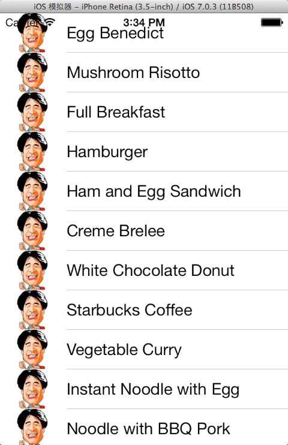

#一起学习iOS开发一:SimpleTable项目

声明：此系列为【一步一步学习iOS6】学习笔记,所有代码均在xcode5,iOS7上运行通过,所有文章逻辑均由**老毕**重新梳理,部分操作及代码有改动,并且备注了N多注释.希望对大家有所帮助

## 一.实例步骤：

```
 1. 设计视图
 2. 添加表数据
 	2.1 修改头文件
 		2.1.1 头文件添加协议:UITableViewDelegate和UITableViewDataSource
	2.2 修改实现方法
 		2.2.1 实现文件里定议一个数组，用于存放数据源
 		2.2.2 viewDidLoad中实例化数组
 		2.2.3 强制实现两个数据源方法
 3. 连接数据源和委托
 4. 视图中添加缩略图
```
## 二.具体实现

### 1. 设计视图
对象库中拖拽Table View对象到视图中


### 2. 添加表数据
#### 2.1 修改头文件
##### 2.1.1 头文件添加协议:UITableViewDelegate和UITableViewDataSource

```
#import <UIKit/UIKit.h>

@interface SimpleTableViewController : UIViewController<UITableViewDelegate,UITableViewDataSource>

@end
```

头文件中添加UITableViewDelegate和UITableViewDataSource，它们是什么呢？

UITableView是表视图幕后的实际类,用来灵活处理不同的数据类型,你可以显示国家列表或者联系人姓名,等。

**你如何告诉 UITableView 需要显示的数据列表呢? **

**UITableViewDataSource** :用来连接你的数据和表视图 

```
UITableViewDataSource 协议定了 2 个要求实现的方法:
(tableView:cellForRowAtIndexPath 和tableView:numberOfRowsInSection)。
通过实现这些方法,你告诉表规图显示多少行数据和每一行中的数据。 
注意:这两个方法是UITableViewDataSource 协议的一部分。在配置UITableView时,需要强制实现这两个方法。 
```

**UITableViewDelegate** :负责处理UITableView的表现

```
UITableViewDelegate 负责处理UITableView的表现。协议中的可选方法让你管理表行的高度,配置节点头部和底部,对表单元重新排序等等。
```
**理解UITableViewDataSource和UITableViewDelegate是如何工作的？**


#### 2.2 修改实现方法
##### 2.2.1 实现文件里定义一个数组，用于存放数据源
```
@implementation SimpleTableViewController
{

    //定义一个实例变量用来存放数组
    NSArray *tableData;
}
```
##### 2.2.2 viewDidLoad中实例化数组

```
- (void)viewDidLoad
{
    //在控制器的视图装载到内存中完成之后,调用该方法
    [super viewDidLoad];
	
    //用arrayWithObjects来实例化一个NSArray对象
    tableData = [NSArray arrayWithObjects:@"Egg Benedict",
                 @"Mushroom Risotto", @"Full Breakfast", @"Hamburger", @"Ham and Egg Sandwich", @"Creme Brelee", @"White Chocolate Donut", @"Starbucks Coffee", @"Vegetable Curry", @"Instant Noodle with Egg", @"Noodle with BBQ Pork", @"Japanese Noodle with Pork", @"GreenTea", @"Thai Shrimp Cake", @"Angry Birds Cake", @"Ham and Cheese Panini", nil];
}
```
##### 2.2.3 强制实现两个数据源方法

**numberOfRowsInSection**

```
//用来通知表视图选择了多少条数据行
-(NSInteger) tableView:(UITableView *)tableView numberOfRowsInSection:(NSInteger)section
{
    return [tableData count];
}
```
**cellForRowAtIndexPath**

```

/*
 每一次数据行显示的时候,都会调用 cellForRowAtIndexPath方法
 请求数据源,在表视图的特定位置插入一个单元格。表视图中可见的每一行都会触发该事件。
 事件中包含的参数之一是 NSIndexPath类型。
 NSIndexPath类表示数组集合中的某个特定项的路径。
 要知道当前填充的是哪一行,需要调用NSIndexPath对象(indexPath)的row 属性,然后使用行号来引用tableData 数组中的元素即可。
 得到的值被用来设置表视图中该行的文本值

 */
-(UITableViewCell *)tableView:(UITableView *)tableView cellForRowAtIndexPath:(NSIndexPath *)indexPath
{
    static NSString *simpleTableIdentifier = @"SimpleTableItem";
    //使用 UITableView 类的dequeueReusableCellWithIdentifer: 方法获取 UITableViewCell 类的一个实例。
    //下面的方法返回的是一个可重用的表规图单元格对象。
    //因为如果表非常大,为每一行都创建一个单独的UITableViewCell对象会产生严重的性能问题,幵占用大量的内存。
    //此外,由于表视图在某一个时刻只显示固定数量的行，因此重用那些已经滚到屏幕外面的那些单元格将非常有意义
    //这正是dequeueReusableCellWithIdentifier要完成的事情
    UITableViewCell *cell = [tableView dequeueReusableCellWithIdentifier:simpleTableIdentifier];
    if (cell == nil) {
    /*
    提示: alloc、init、new的区别：
    1. 概括来说，new和alloc/init在功能上几乎是一致的，分配内存并完成初始化。
    2. alloc 和 init 别把分配内存和初始化的工作分开。new 分配内存和初始化的工作一起完成了，先分配内存，然后调用类的构造函数。
    3. 采用new的方式只能采用默认的init方法完成初始化
    4. 采用alloc的方式可以用其他定制的初始化方法
    */
    /*
    注释:
    就是从队列中根据标示符取出一个暂时不用的cell，只有cell为nil，也就是队列中没有旧的cell的时候，
才会执行：
    /*
        cell = [[UITableViewCell alloc]
                initWithStyle:UITableViewCellStyleDefault reuseIdentifier:simpleTableIdentifier];
    }
    cell.textLabel.text = [tableData objectAtIndex:indexPath.row];
    return cell;
}

```
### 3. 连接数据源和委托


**运行结果：**


### 4. 视图中添加缩略图

#### 4.1 添加图片到项目中
右击SimpleTable -- Add Files to "SimpleTable.." --  选中要添加的图片 -- Add 
#### 4.2 cellForRowAtIndexPath中添加代码
SimpleTableViewController.m中的cellForRowAtIndexPath方法添加如下代码:

```
cell.imageView.image = [UIImage imageNamed:@"wirelessqa.jpg"];
```

#### 4.3 查看运行结果


***注意: 实际上,表数据不在代码中直接指定。通常,表数据将从文件、数据库戒者其他地方加载***

----
####  微信公众帐号: wirelessqa 


#### 关于作者：

**作者:** 毕小朋 | 老 毕  **邮箱:** <wirelessqa.me@gmail.com> 

**微博:** [@WirelessQA](http://www.weibo.com/wirelessqa) **博客:** <http://blog.csdn.net/wirelessqa>

----


