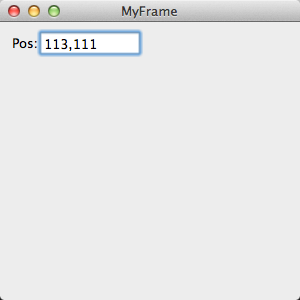
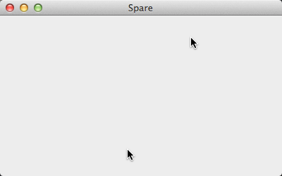
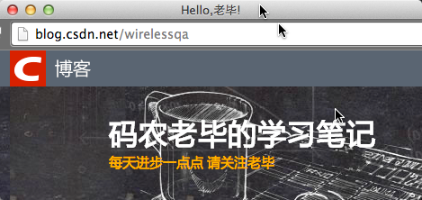
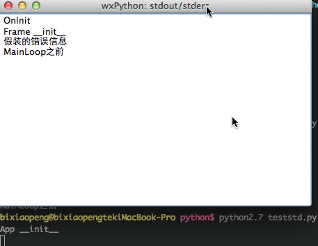
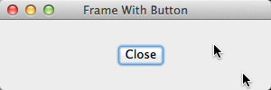
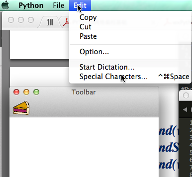
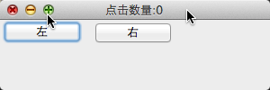

## 一. 基础入门

### 1.1.下面是一个例子,它创建了一个有一个文本框的窗口用来显示鼠标的位置

```
#!/bin/env python
# -*- coding: utf-8 -*-

import wx
class MyFrame(wx.Frame):
	def __init__(self):
		wx.Frame.__init__(self,None,-1,"MyFrame",size=(300,300))
		panel = wx.Panel(self,-1)
		panel.Bind(wx.EVT_MOTION,self.OnMove)
		wx.StaticText(panel,-1,"Pos:",pos=(10,12))
		self.posCtrl = wx.TextCtrl(panel,-1,"",pos=(40,10))

	def OnMove(self,event)	:
		pos = event.GetPosition()
		self.posCtrl.SetValue("%s,%s" % (pos.x,pos.y))

if __name__=='__main__':
	app = wx.App() #原wx.PySimpleApp()函数已经放弃了
	frame = MyFrame()
	frame.Show(True)
	app.MainLoop()


```

### 运行结果:



### 1.2. 开发一个wxPython程序所必须的五个基本步骤

```
# -*- coding: utf-8 -*-

#开发一个wxPython程序所必须的五个基本步骤
import wx  #导入必须的wxPython包

class App(wx.App): #子类化wxPython应用程序类
	def OnInit(self): #定义一个应用程序初始化方法
		frame = wx.Frame(parent=None,id=-1,title='你好,老毕')
		frame.Show()
		return True

app = App() #创建一个应用类的实例
app.MainLoop()	#进入这个应用程序的主事件循环
```

### 1.3. spare.py 扩展最小的空的wxPython程序


	#!/usr/bin/env python
	# -*- coding: utf-8 -*-

	"""spare.py 扩展最小的空的wxPython程序"""


	import wx  #导入必须的wxPython包

	class Frame(wx.Frame): #定义自己的Frame类作为wx.Frame的子类
		pass

	class App(wx.App): #子类化wxPython应用程序类

	def OnInit(self): #定义一个应用程序初始化方法
		self.frame = Frame(parent=None,title='Spare') #对frame实例的引用作为应用程序实例的一个属性
		self.frame.Show()
		self.SetTopWindow(self.frame) #可选方法,它让wxPython方法知道哪个框架或对话框将被认为是主要的
		return True

	if __name__=='__main__':
		app = App() #创建一个应用类的实例
		app.MainLoop()	#进入这个应用程序的主事件循环
	



### 1.4. 最终的hello.py

```
#!/usr/bin/env python
# -*- coding: utf-8 -*-

"""最终的hello.py"""


import wx  #导入必须的wxPython包

class Frame(wx.Frame): #2. 定义自己的Frame类作为wx.Frame的子类
	#3. 图像参数
	def __init__(self,image,parent=None,id=-1,pos=wx.DefaultPosition,title='Hello,老毕!'):
		#4. 显示图像
		temp = image.ConvertToBitmap()
		size = temp.GetWidth(),temp.GetHeight()
		wx.Frame.__init__(self,parent,id,title,pos,size)
		self.bmp = wx.StaticBitmap(parent=self,bitmap=temp)

class App(wx.App): #5. 子类化wxPython应用程序类

	def OnInit(self): #定义一个应用程序初始化方法
		#6. 图像处理
		image = wx.Image('wirelessqa.png',wx.BITMAP_TYPE_PNG)
		self.frame = Frame(image)
		self.frame.Show()
		self.SetTopWindow(self.frame) #可选方法,它让wxPython方法知道哪个框架或对话框将被认为是主要的
		return True

def main(): #7
	app = App()
	app.MainLoop()		

if __name__=='__main__':
	main()
```



## 二. 输出重定向

### 2.1 输出重定向

```
#!/usr/bin/env python
# -*- coding: utf-8 -*-

import wx
import sys

class Frame(wx.Frame):

	def __init__(self,parent,id,title):
		print "Frame __init__"
		wx.Frame.__init__(self,parent,id,title)


class App(wx.App):
	
	def __init__(self,redirect=True,filename=None):
		print "App __init__"
		wx.App.__init__(self,redirect,filename)

	def OnInit(self):
		print "OnInit"	#输出到stdout
		self.frame = Frame(parent=None,id=-1,title='Startup') #创建框架
		self.frame.Show()
		self.SetTopWindow(self.frame)
		print >>sys.stderr,"假装的错误信息" #输出到stderr
		return True
	def OnExit(self):
		print "OnExit"

if __name__=='__main__':
	app = App(redirect = True) #重定向输出到新框架
	# app = App(redirect = False) #没有重定向,全部都会显示在终端
	# app = App(True,"output") #重定向到文件
	print "MainLoop之前"
	app.MainLoop()
	print "MainLoop之后"
```

#### 1. 重定向输出到新框架




```
#控制台输出
bixiaopeng@bixiaopengtekiMacBook-Pro python$ python2.7 teststd.py
App __init__
MainLoop之后
```
#### 2.没有重定向,全部都会显示在终端

```
bixiaopeng@bixiaopengtekiMacBook-Pro python$ python2.7 teststd.py
App __init__
OnInit
Frame __init__
假装的错误信息
MainLoop之前
OnExit
MainLoop之后
```

#### 3.重定向到文件

```
bixiaopeng@bixiaopengtekiMacBook-Pro python$ python2.7 teststd.py
App __init__
MainLoop之后
bixiaopeng@bixiaopengtekiMacBook-Pro python$ cat output
OnInit
Frame __init__
假装的错误信息
MainLoop之前
OnExit
```

### 2.6.1 给框架增加窗口部件

```
#!/usr/bin/env python
# -*- coding:utf-8 -*-

import wx

class InsertFrame(wx.Frame):

	def __init__(self,parent,id):

		wx.Frame.__init__(self,parent,id,'Frame With Button',size=(300,100))
		panel = wx.Panel(self) #创建画板

		button = wx.Button(panel,label="Close",pos=(125,10),size=(50,50))#将按钮添加到画板
		#绑定按钮的单击事件
		self.Bind(wx.EVT_BUTTON,self.OnCloseMe,button)
		#绑定窗口的关闭事件
		self.Bind(wx.EVT_CLOSE,self.OnCloseWindow)

	def OnCloseMe(self,event):
		self.Close(True)

	def OnCloseWindow(self,event):
		self.Destroy()

if __name__=='__main__':
	app = wx.App()
	frame = InsertFrame(parent=None,id=-1)
	frame.Show()
	app.MainLoop()
```

运行:



### 2.4 给框架增加菜单栏、工具栏和状态栏

```
# -*- coding:utf-8 -*-

import wx
import wx.py.images as images

class ToolbarFrame(wx.Frame):
	def __init__(self,parent,id):
		wx.Frame.__init__(self,parent,id,"Toolbar",size=(300,200))
		panel = wx.Panel(self)
		panel.SetBackgroundColour('White')
		statusBar = self.CreateStatusBar() #1. 创建状态栏
		toolbar = self.CreateToolBar() #2. 创建工具栏
		toolbar.AddSimpleTool(wx.NewId(),images.getPyBitmap(),"New","Long help for 'new' ") #3. 给工具栏增加一个工具

		toolbar.Realize() #4 准备显示工具栏
		menuBar = wx.MenuBar() # 创建菜单栏

		menu1 = wx.Menu() #创建两个菜单
		menuBar.Append(menu1,"&File")
		menu2 = wx.Menu()
		#创建菜单的项目
		menu2.Append(wx.NewId(),"Copy","Copy in status bar")
		menu2.Append(wx.NewId(),"Cut","把你剪了哦")
		menu2.Append(wx.NewId(),"Paste","")
		menu2.AppendSeparator()
		menu2.Append(wx.NewId(),"Option...","Display Options")
		menuBar.Append(menu2,"&Edit") #在菜单栏上附上菜单
		self.SetMenuBar(menuBar) #在框架上附上菜单栏

if __name__ == '__main__':
	app = wx.App()
	frame = ToolbarFrame(parent=None,id=-1)
	frame.Show()
	app.MainLoop()

```



### 3.5 管理窗口部件的代码

```
# -*- coding:utf-8 -*-

#自定义的事 件TwoButtonEvent仅当用户敲击了这两个按钮之后被触发。这个事件包含了一 个关于用户在该部件上敲击次数的计数。

import wx

class TwoButtonEvent(wx.PyCommandEvent): #1.定义事件
	def __init__(self,evtType,id):
		wx.PyCommandEvent.__init__(self,evtType,id)
		self.clickCount = 0

	def GetClickCount(self):
		return self.clickCount

	def SetClickCount(self,count):
		self.clickCount = count

"""
全局函数wx.NewEventType()的作用类似于wx.NewId();它返回一个唯 一的事件类型ID。这个唯一的值标识了一个应用于事件处理系统的事件类型
"""
myEVT_TWO_BUTTON = wx.NewEventType()	#2. 创建一个事件类型	

EVT_TWO_BUTTON = wx.PyEventBinder(myEVT_TWO_BUTTON,1) #3. 创建一个绑定器对象

class TwoButtonPanel(wx.Panel):
	
	def __init__(self,parent,id= -1,leftText="左",rightText="右"):
		wx.Panel.__init__(self,parent,id)
		self.leftButton = wx.Button(self,label = leftText)
		self.rightButton = wx.Button(self,label = rightText,pos = (100,0))
		self.leftClick = False
		self.rightClick = False
		self.clickCount = 0

		#4. 下面两行绑定更低级的事件

		"""
		为了创建这个新的更高级的命令事件,程序必需响应特定的用户事件,
		例如,在每个按钮对象上的鼠标左键按下。依据哪个按钮被敲击,该事件被绑定到OnLeftClick()和OnRightClick()方法。
		处理器设置了布尔值,以表明按键是否被敲击
		"""
		self.leftButton.Bind(wx.EVT_LEFT_DOWN,self.OnLeftClick)
		self.rightButton.Bind(wx.EVT_LEFT_DOWN,self.OnRightClick)

	"""
	#5 #6 Skip()的调用允许在该事件处理完成后的进一步处理。
	在这里,这个 新的事件不需要skip调用;它在事件处理器完成之前被分派了(self.OnClick())。 
	但是所有的鼠标左键按下事件需要调用Skip(),以便处理器不把最后的按钮敲击挂起。
	这个程序没有处理按钮敲击事件,但是由于使用了Skip(),wxPython 在敲击期间使用按钮敲击事件来正确地绘制按钮。
	如果被挂起了,用户将不会 得到来自按钮按下的反馈。
	"""	

	def OnLeftClick(self,event):
		self.leftClick = True
		self.OnClick()
		event.Skip() #5. 继续处理

	def OnRightClick(self,event):
		self.rightClick = True
		self.OnClick()
		event.Skip() #6. 继续处理

	def OnClick(self):
		self.clickCount += 1
		if self.leftClick and self.rightClick:
			self.leftClick = False
			self.rightClick = False
			"""
			如果两个按钮都被敲击了,该代码创建这个新事件的一个实例。
			事件类 型和两个按钮的ID作为构造器的参数。
			通常,一个事件类可以有多个事件类 型,尽管本例中不是这样
			"""
			evt = TwoButtonEvent(myEVT_TWO_BUTTON,self.GetId()) #7. 创建自定义事件
			evt.SetClickCount(self.clickCount) #添加数据到事件
			##8 ProcessEvent()的调用将这个新事件引入到事件处理系统中
			#GetEventHandler()调用返回wx.EvtHandler 的一个实例。
			#大多数情况下,返回的实例是窗口部件对象本身,但是如果其它 的wx.EvtHandler()方法已经被压入了事件处理器堆栈,那么返回的将是堆栈项 的项目。
			self.GetEventHandler().ProcessEvent(evt) #8. 处理事件

class CustomEventFrame(wx.Frame):
	def __init__(self,parent,id):
		wx.Frame.__init__(self,parent,id,'点击数量:0',size=(300,100))
		panel = TwoButtonPanel(self)
		self.Bind(EVT_TWO_BUTTON,self.OnTwoClick,panel)# 9.绑定自定义事件

	def OnTwoClick(self,event): #10. 定义一个事件处理器函数,用来显示窗口的标题以显示敲击数
		self.SetTitle("Click Count:%s " % event.GetClickCount())

if __name__=='__main__':
	app = wx.App()
	frame = CustomEventFrame(parent=None,id=-1)
	frame.Show()
	app.MainLoop()


```



----
####  微信公众帐号: wirelessqa 


#### 关于作者：

**作者:** 毕小朋 | 老 毕  **邮箱:** <wirelessqa.me@gmail.com> 

**微博:** [@WirelessQA](http://www.weibo.com/wirelessqa) **博客:** <http://blog.csdn.net/wirelessqa>

----