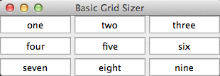
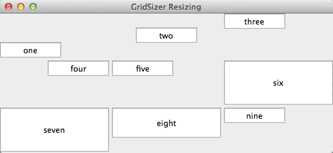
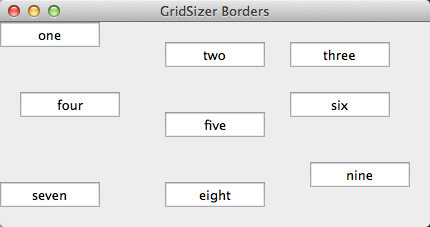
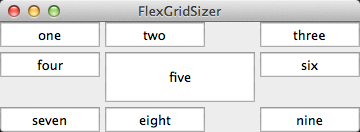
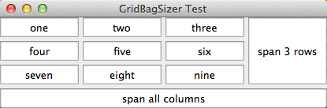
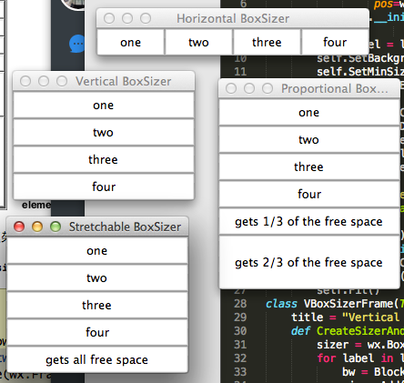

## wxPython中预定义的sizer

>规则网格用Grid 

>不同尺寸用Flex grid

>随意放置用Grid bag

>同一条线上用Box

>带有标准的Box sizer用Static box


sizer|  说明
----|----
Grid|一个十分基础的网格布局。当你要放置的窗口部件都是同样的尺寸且整齐地放入一个规则的网格中是使用它。
Flex grid|对grid sizer稍微做了些改变，当窗口部件有不同的尺寸时，可以有更好的结果。
Grid bag|grid sizer系列中最灵活的成员。使得网格中的窗口部件可以更随意的放置。
Box|在一条水平或垂直线上的窗口部件的布局。当尺寸改变时，在控制窗口部件的的行为上很灵活。通常用于嵌套的样式。可用于几乎任何类型的布局。
Static box|一个标准的box sizer。带有标题和环线。


## 使用一个sizer的三个基本步骤：

### 1. 创建并关联sizer到一个容器。

sizer被关联到容器使用wx.Window的SetSizer(sizer)方法。

由于这是一个wx.Window的方法，所以这意味着任何wxPython窗口部件都可以有一个sizer，尽管sizer只对容器类的窗口部件有意义。

### 2. 添加每个孩子到这个sizer。

所有的孩子窗口部件需要被单独添加到该sizer。仅仅创建使用容器作为父亲的孩子窗口部件是不够的。还要将孩子窗口部件添加到一个sizer，这个主要的方法是Add()。Add()方法有一对不同的标记

### 3.（可选的）使sizer能够计算它的尺寸。

告诉sizer去根据它的孩子来计算它的尺寸，这通过在父窗口对象上调用wx.Window的Fit()方法或该sizer的Fit(window)方法。（这个窗口方法重定向到sizer方法。）

两种情况下，这个Fit()方法都要求sizer根据它所掌握的它的孩子的情况去计算它的尺寸，并且它调整父窗口部件到合适的尺寸。还有一个相关的方法：FitInside()，它不改变父窗口部件的显示尺寸，但是它改变它虚拟尺寸——这意味着如果窗口部件是在一个可滚动的面板中，那么wxPython会重新计算是否需要滚动条。


## 规则网格用grid sizer



```
#-*-coding:utf-8-*-

import wx
class BlockWindow(wx.Panel):
    def __init__(self, parent, ID=-1, label="",
                 pos=wx.DefaultPosition, size=(100, 25)):
        wx.Panel.__init__(self, parent, ID, pos, size,
                          wx.RAISED_BORDER, label)
        self.label = label
        self.SetBackgroundColour("white")
        self.SetMinSize(size)
        self.Bind(wx.EVT_PAINT, self.OnPaint)
    def OnPaint(self, evt):
        sz = self.GetClientSize()
        dc = wx.PaintDC(self)
        w,h = dc.GetTextExtent(self.label)
        dc.SetFont(self.GetFont())
        dc.DrawText(self.label, (sz.width-w)/2, (sz.height-h)/2)

labels = "one two three four five six seven eight nine".split()

class GridSizerFrame(wx.Frame):
    def __init__(self):
        wx.Frame.__init__(self, None, -1, "Basic Grid Sizer")
        #wx.GridSizer(rows, cols, vgap, hgap)
        sizer = wx.GridSizer(rows=3, cols=3, hgap=5, vgap=5)#创建grid sizer
        for label in labels:
            bw = BlockWindow(self, label=label)
            sizer.Add(bw, 0, 0)#添加窗口部件到sizer
        self.SetSizer(sizer)#把sizer与框架关联起来
        self.Fit()

app = wx.App()
GridSizerFrame().Show()
app.MainLoop()        
```

## 如何对sizer添加孩子？

### 1.使用add方法

>添加一个窗口部件到一个sizer中的最常用的方法是Add()，它将新的窗口部件添加到sizer的孩子列表的尾部。

```
Add(window, proportion=0, flag=0, border=0, userData=None)
Add(sizer, proportion=0, flag=0, border=0, userData=None)
Add(size, proportion=0, flag=0, border=0, userData=None)
```
### 2.使用insert方法

>这里有用于将新的窗口部件插入到sizer中不同位置的方法。insert()方法使你能够按任意的索引来放置新的窗口部件。它也有三个形式

```
Insert(index, window, proportion=0, flag=0, border=0, userData=None)
Insert(index, sizer, proportion=0, flag=0, border=0, userData=None)
Insert(index, size, proportion=0, flag=0, border=0, userData=None)
```
### 3.使用Prepend方法
>该方法将新的窗口部件、sizer或空白添加到sizer的列表的开头，这意味所添加的东西将被显示到左上角

```
Prepend(window, proportion=0, flag=0, border=0, userData=None)
Prepend(sizer, proportion=0, flag=0, border=0, userData=None)
Prepend(size, proportion=0, flag=0, border=0, userData=None)
```

## 如何对sizer移除孩子？

### 1.使用Detach()方法

为了从sizer中移除一项，你需要调用Detach()方法，它从sizer中移除项目，但是没有销毁该项目。这对于你以后再使用它是有用的。

使用Detach()有三种方法。你可以将你想要移除的窗口、sizer对象、对象的索引作为参数传递给Detach()：

```
Detach(window)
Detach(sizer)
Detach(index)
```

## sizer是如何管理它的孩子的尺寸和对齐的？



```
#-*-coding:utf-8-*-

import wx
class BlockWindow(wx.Panel):
    def __init__(self, parent, ID=-1, label="",
                 pos=wx.DefaultPosition, size=(100, 25)):
        wx.Panel.__init__(self, parent, ID, pos, size,
                          wx.RAISED_BORDER, label)
        self.label = label
        self.SetBackgroundColour("white")
        self.SetMinSize(size)
        self.Bind(wx.EVT_PAINT, self.OnPaint)
    def OnPaint(self, evt):
        sz = self.GetClientSize()
        dc = wx.PaintDC(self)
        w,h = dc.GetTextExtent(self.label)
        dc.SetFont(self.GetFont())
        dc.DrawText(self.label, (sz.width-w)/2, (sz.height-h)/2)

labels = "one two three four five six seven eight nine".split()
#对齐标记
flags = {"one": wx.ALIGN_BOTTOM, "two": wx.ALIGN_CENTER,
         "four": wx.ALIGN_RIGHT, "six": wx.EXPAND, "seven": wx.EXPAND,
         "eight": wx.SHAPED}
class TestFrame(wx.Frame):
    def __init__(self):
        wx.Frame.__init__(self, None, -1, "GridSizer Resizing")
        sizer = wx.GridSizer(rows=3, cols=3, hgap=5, vgap=5)
        for label in labels:
            bw = BlockWindow(self, label=label)
            flag = flags.get(label, 0)
            sizer.Add(bw, 0, flag)
        self.SetSizer(sizer)
        self.Fit()
app = wx.App()
TestFrame().Show()
app.MainLoop()

'''
在这个例子中，窗口部件“one,” “two,” 和“four”分别使用wx.ALIGN_BOTTOM, wx.ALIGN_CENTER, and wx.ALIGN_RIGHT标记改变它们的对齐方式。
当窗口大小改变时，你可以看到效果，部件“three"没有指定一个标记，所以它按左上角对齐。
窗口"six"和"seven"均使用了wx.EXPAND标记来告诉sizer改变它们的尺寸以填满格子，
而窗口部件"eight"使用wx.SHAPED来改变它的尺寸，以保持比例不变。
'''     
```

## sizer如何管理每个孩子的边框？



```
#-*-coding:utf-8-*-

import wx
class BlockWindow(wx.Panel):
    def __init__(self, parent, ID=-1, label="",
                 pos=wx.DefaultPosition, size=(100, 25)):
        wx.Panel.__init__(self, parent, ID, pos, size,
                          wx.RAISED_BORDER, label)
        self.label = label
        self.SetBackgroundColour("white")
        self.SetMinSize(size)
        self.Bind(wx.EVT_PAINT, self.OnPaint)
    def OnPaint(self, evt):
        sz = self.GetClientSize()
        dc = wx.PaintDC(self)
        w,h = dc.GetTextExtent(self.label)
        dc.SetFont(self.GetFont())
        dc.DrawText(self.label, (sz.width-w)/2, (sz.height-h)/2)

labels = "one two three four five six seven eight nine".split()
#边框标记
flags = {"one": wx.BOTTOM, "two": wx.ALL, "three": wx.TOP,
         "four": wx.LEFT, "five": wx.ALL, "six": wx.RIGHT,
         "seven": wx.BOTTOM | wx.TOP, "eight": wx.ALL,
         "nine": wx.LEFT | wx.RIGHT}
class TestFrame(wx.Frame):
    def __init__(self):
        wx.Frame.__init__(self, None, -1, "GridSizer Borders")
        sizer = wx.GridSizer(rows=3, cols=3, hgap=5, vgap=5)
        for label in labels:
            bw = BlockWindow(self, label=label)
            flag = flags.get(label, 0)
            sizer.Add(bw, 0, flag, 10)#添加指定边框的窗口部件
        self.SetSizer(sizer)
        self.Fit()
app = wx.App()
TestFrame().Show()
app.MainLoop()

'''
要在一个sizer中的窗口部件周围放置边框，需要两步。
第一步是当窗口部件被添加到该sizer时，传递额外的标记给flags参数。
你可以使用标记wx.ALL来指定边框围绕整个窗口部件，或使用wx.BOTTOM, wx.LEFT, wx.RIGHT, wx.TOP来指定某一边有边框。
这些标记当然可以组合成你想要的，如wx.RIGHT | wx.BOTTOM将使你的窗口部件的右边和底边有边框。
由于边框、尺寸调整、对齐这些信息都是经由flags参数，所以对于同一个窗口部件，你通常必须将三种标记组合起来使用。


'''  
```

## 什么是flex grid sizer？

flex grid sizer是grid sizer的一个更灵活的版本。它与标准的grid sizer几乎相同，除了下面的例外：

1、每行和每列可以有各自的尺寸。

2、默认情况下，当尺寸调整时，它不改变它的单元格的尺寸。如果需要的话，你可以指定哪行或哪列应该增长。

3、它可以在两个方向之一灵活地增长，意思是你可以为个别的子元素指定比列量，并且你可以指定固定方向上的行为。



```
#-*-coding:utf-8-*-

import wx
class BlockWindow(wx.Panel):
    def __init__(self, parent, ID=-1, label="",
                 pos=wx.DefaultPosition, size=(100, 25)):
        wx.Panel.__init__(self, parent, ID, pos, size,
                          wx.RAISED_BORDER, label)
        self.label = label
        self.SetBackgroundColour("white")
        self.SetMinSize(size)
        self.Bind(wx.EVT_PAINT, self.OnPaint)
    def OnPaint(self, evt):
        sz = self.GetClientSize()
        dc = wx.PaintDC(self)
        w,h = dc.GetTextExtent(self.label)
        dc.SetFont(self.GetFont())
        dc.DrawText(self.label, (sz.width-w)/2, (sz.height-h)/2)

labels = "one two three four five six seven eight nine".split()
class TestFrame(wx.Frame):
    def __init__(self):
        wx.Frame.__init__(self, None, -1, "FlexGridSizer")
        sizer = wx.FlexGridSizer(rows=3, cols=3, hgap=5, vgap=5)
        for label in labels:
            bw = BlockWindow(self, label=label)
            sizer.Add(bw, 0, 0)
        center = self.  ("five")
        center.SetMinSize((150,50))
        self.SetSizer(sizer)
        self.Fit()
app = wx.App()
TestFrame().Show()
app.MainLoop()

'''
一个flex grid sizer是wx.FlexGridSizer的一个实例。
类wx.FlexGridSizer是wx.GridSizer的子类，所以wx.GridSizer的属性方法依然有效。
wx.FlexGridSizer的构造函数与其父类的相同：wx.FlexGridSizer(rows, cols, vgap, hgap)

'''  
```

### 增加行和列

```
class TestFrame(wx.Frame):
    def __init__(self):
        wx.Frame.__init__(self, None, -1, "Resizing Flex Grid Sizer")
        sizer = wx.FlexGridSizer(rows=3, cols=3, hgap=5, vgap=5)
        for label in labels:
            bw = BlockWindow(self, label=label)
            sizer.Add(bw, 0, 0)
        center = self.FindWindowByName("five")
        center.SetMinSize((150,50))
        sizer.AddGrowableCol(0, 1)
        sizer.AddGrowableCol(1, 2)
        sizer.AddGrowableCol(2, 1)
        sizer.AddGrowableRow(0, 1)
        sizer.AddGrowableRow(1, 5)
        sizer.AddGrowableRow(2, 1)
        self.SetSizer(sizer)
        self.Fit()
```

## 什么是grid bag sizer?

grid bag sizer是对flex grid sizer进一步的增强。在grid bag sizer中有两个新的变化：

1、能够将一个窗口部件添加到一个特定的单元格。 

2、能够使一个窗口部件跨越几个单元格（就像HTML表单中的表格所能做的一样）。



```
#-*-coding:utf-8-*-

import wx
class BlockWindow(wx.Panel):
    def __init__(self, parent, ID=-1, label="",
                 pos=wx.DefaultPosition, size=(100, 25)):
        wx.Panel.__init__(self, parent, ID, pos, size,
                          wx.RAISED_BORDER, label)
        self.label = label
        self.SetBackgroundColour("white")
        self.SetMinSize(size)
        self.Bind(wx.EVT_PAINT, self.OnPaint)
    def OnPaint(self, evt):
        sz = self.GetClientSize()
        dc = wx.PaintDC(self)
        w,h = dc.GetTextExtent(self.label)
        dc.SetFont(self.GetFont())
        dc.DrawText(self.label, (sz.width-w)/2, (sz.height-h)/2)
labels = "one two three four five six seven eight nine".split()        

class TestFrame(wx.Frame):
    def __init__(self):
        wx.Frame.__init__(self, None, -1, "GridBagSizer Test")
        #在一个grid bag sizer中，你不必去指定行和列的数量，因为你可以直接将子项目添加进特定的单元格——sizer将据此计算出网格的尺度。
        sizer = wx.GridBagSizer(hgap=5, vgap=5)
        for col in range(3):
            for row in range(3):
                bw = BlockWindow(self, label=labels[row*3 + col])
                sizer.Add(bw, pos=(row,col))
        
        # 跨行
        bw = BlockWindow(self, label="span 3 rows")
        '''
        @pos参数代表sizer中的窗口部件要赋予的单元格
        pos参数是类wx.GBPosition的一个实例，但是通过wxPython变换，你可以仅传递一个(行,列)形式的元组，grid bag的左上角是(0,0)
        @span参数代表窗口部件应该占据的行和列的数量
        它是类wx.GBSpan的一个实例，
        但是，wxPython也使你能够传递一个(行的范围，列的范围)形式的元组。
        如果跨度没有指定，那么默认值是(1,1)，这意味该窗口部件在两个方向都只能占据一个单元格。
        例如，要在第二行第一列放置一个窗口部件，
        并且使它占据三行两列，那么你将这样调用：Add(widget, (1, 0), (3, 2))（索引是从0开始的）。
        '''
        sizer.Add(bw, pos=(0,3), span=(3,1), flag=wx.EXPAND)

        # 跨列
        bw = BlockWindow(self, label="span all columns")
        sizer.Add(bw, pos=(3,0), span=(1,4), flag=wx.EXPAND)
        # 使最后的行和列可增长
        sizer.AddGrowableCol(3)
        sizer.AddGrowableRow(3)
        self.SetSizer(sizer)
        self.Fit()
app = wx.App()
TestFrame().Show()
app.MainLoop()

```

## 什么是box sizer?

box sizer是wxPython所提供的sizer中的最简单和最灵活的sizer。

一个box sizer是一个垂直列或水平行，窗口部件在其中从左至右或从上到下布置在一条线上。

虽然这听起来好像用处太简单，但是来自相互之间嵌套sizer的能力使你能够在每行或每列很容易放置不同数量的项目。

由于每个sizer都是一个独立的实体，因此你的布局就有了更多的灵活性。

对于大多数的应用程序，一个嵌套有水平sizer的垂直sizer将使你能够创建你所需要的布局。




