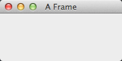
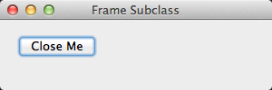
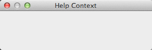
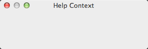
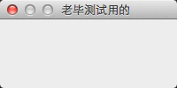
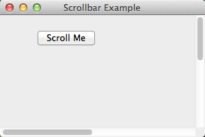
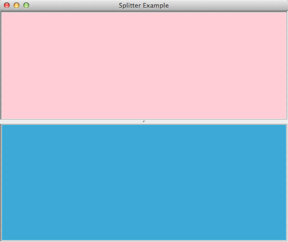

>参考:http://wiki.woodpecker.org.cn/moin/WxPythonInAction/ChapterEight

## 创建一个简单的框架



> 默认样式提供了标准框架的装饰如关闭框、最小化和最大化框

```
import wx

if __name__ == '__main__':
    app = wx.App()
    frame = wx.Frame(None, -1, "A Frame", style=wx.DEFAULT_FRAME_STYLE,
        size=(200, 100))
    frame.Show()
    app.MainLoop()
```
## 一个简单的框架子类



```
import wx

class SubclassFrame(wx.Frame):
    def __init__(self):
        wx.Frame.__init__(self, None, -1, 'Frame Subclass', 
                size=(300, 100))
        panel = wx.Panel(self, -1)
        button = wx.Button(panel, -1, "Close Me", pos=(15, 15))
        self.Bind(wx.EVT_BUTTON, self.OnCloseMe, button)
        self.Bind(wx.EVT_CLOSE, self.OnCloseWindow)

    def OnCloseMe(self, event):
        self.Close(True)

    def OnCloseWindow(self, event):
        self.Destroy()

if __name__ == '__main__':
    app = wx.App()
    SubclassFrame().Show()
    app.MainLoop()
```


## 添加额外样式信息



```
#-*- coding:utf-8-*-
import wx

'''
添加额外样式信息使用wx.PreFrame
'''
class HelpFrame(wx.Frame):

    def __init__(self):
        pre = wx.PreFrame() #1 预构建对象
        pre.SetExtraStyle(wx.FRAME_EX_CONTEXTHELP)
        pre.Create(None, -1, "Help Context", size=(300, 100),
                style=wx.DEFAULT_FRAME_STYLE ^
                (wx.MINIMIZE_BOX | wx.MAXIMIZE_BOX)) #2 创建框架
        self.PostCreate(pre) #3 底层C++指针的传递

if __name__ == '__main__':
    app = wx.App()
    HelpFrame().Show()
    app.MainLoop()
```


>在Mac OS X上，使用这个样式的框架有一个金属质感的外观。这是一个附加样式，必须使用SetExtraStyle方法来设置

```
pre.SetExtraStyle(wx.FRAME_EX_METAL)
```

## 添加额外样式信息的通用方法



```
#-*-coding:utf-8-*-

import wx

class HelpFrame(wx.Frame):

    def __init__(self, parent, ID, title,pos=wx.DefaultPosition, size=(200,100),style=wx.DEFAULT_DIALOG_STYLE):
            
        twoStepCreate(self, wx.PreFrame, self.preInit, parent,ID, title, pos, size, style)
    
    def preInit(self, pre):
        pre.SetExtraStyle(wx.FRAME_EX_CONTEXTHELP)

'''
@instance： 实际被创建的实例
@preClass:  临时的预类的类对象
@preInitFunc: 一个函数对象，它通常作为回调函数用于该实例的初始化
@... 随便加参数
'''

def twoStepCreate(instance, preClass, preInitFunc, *args,**kwargs):
    pre = preClass() #预构建对象
    preInitFunc(pre) #设置风格
    pre.Create(*args, **kwargs) #创建框架
    instance.PostCreate(pre)# 调用来将内在的值从pre移给实例

if __name__ == '__main__':
    app = wx.App()
    HelpFrame(None,-1,"老毕测试用的").Show()
    app.MainLoop()
```

## 滚动窗口



```
#-*-coding:utf-8-*-

import wx

class ScrollbarFrame(wx.Frame):
    def __init__(self):
        wx.Frame.__init__(self, None, -1, 'Scrollbar Example', 
                size=(300, 200))
        self.scroll = wx.ScrolledWindow(self, -1)
        #指定滚动区域: SetScrollbars(pixelsPerUnitX, pixelsPerUnitY, noUnitsX, noUnitsY,xPos=0, yPos=0, noRefresh=False)
        self.scroll.SetScrollbars(1, 1, 600, 400)
        self.button = wx.Button(self.scroll, -1, "Scroll Me", pos=(50, 20))
        self.Bind(wx.EVT_BUTTON,  self.OnClickTop, self.button)
        self.button2 = wx.Button(self.scroll, -1, "Scroll Back", pos=(500, 350))
        self.Bind(wx.EVT_BUTTON, self.OnClickBottom, self.button2)

    def OnClickTop(self, event):
        self.scroll.Scroll(600, 400)
        
    def OnClickBottom(self, event):
        self.scroll.Scroll(1, 1)
        
if __name__ == '__main__':
    app = wx.App()
    frame = ScrollbarFrame()
    frame.Show()
    app.MainLoop()
```

## 创建不规则形状

```
#-*-coding:utf-8-*-

import wx
import wx.py.images as images

class ShapedFrame(wx.Frame):
    def __init__(self):
        wx.Frame.__init__(self, None, -1, "Shaped Window",
                style = wx.FRAME_SHAPED | wx.SIMPLE_BORDER |
                wx.FRAME_NO_TASKBAR)
        self.hasShape = False

#1 获取图像：在从images模块得到图像后，我们将窗口内部的尺寸设置为位图的尺寸。
#你也可以根据一个标准的图像文件来创建这个wxPython位图
        self.bmp = images.getPyBitmap()
        self.SetClientSize((self.bmp.GetWidth(), self.bmp.GetHeight()))

#2 绘制图像：我们在窗口中绘制这个图像。这决不是一个必然的选择。
#你可以像其它窗口一样在该形状窗口中放置窗口部件和文本
        dc = wx.ClientDC(self)
        dc.DrawBitmap(self.bmp, 0,0, True)

        self.SetWindowShape()
        self.Bind(wx.EVT_LEFT_DCLICK, self.OnDoubleClick)
        self.Bind(wx.EVT_RIGHT_UP, self.OnExit)
        self.Bind(wx.EVT_PAINT, self.OnPaint)
        #这个事件在大多数平台上是多余的，它强制性地在窗口被创建后调用SetWindowShape()。
        #但是，GTK的实现要求在该形状被设置以前，窗口的本地UI对象被创建和确定，
        #因此当窗口创建发生时我们使用窗口创建事件去通知并在它的处理器中设置形状。
        self.Bind(wx.EVT_WINDOW_CREATE, self.SetWindowShape)#3 绑定窗口创建事件

        '''
        使用全局方法wx.RegionFromBitmap去创建设置形状所需的wx.Region对象。
        这是创建不规则形状的最容易的方法。
        你也可以根据一个定义多边形的点的列表来创建一个wx.Region。
        图像的透明部分的用途是定义区域的边界。
        '''
    def SetWindowShape(self, evt=None):#4 设置形状
        r = wx.RegionFromBitmap(self.bmp)
        self.hasShape = self.SetShape(r)

        '''
        双击事件开关窗口的形状。
        要回到标准的矩形，要使用一个空的wx.Region作为参数来调用SetShape()
        '''
    def OnDoubleClick(self, evt):
        if self.hasShape:
            self.SetShape(wx.Region())#5 重置形状
            self.hasShape = False
        else:
            self.SetWindowShape()

    def OnPaint(self, evt):
        dc = wx.PaintDC(self)
        dc.DrawBitmap(self.bmp, 0,0, True)

    def OnExit(self, evt):
        self.Close()

if __name__ == '__main__':
    app = wx.App()
    ShapedFrame().Show()
    app.MainLoop()
```

## 如何拖动没有标题栏的框架？

```
#-*-coding:utf-8-*-

import wx
import wx.py.images as images

class ShapedFrame(wx.Frame):
    def __init__(self):
        wx.Frame.__init__(self, None, -1, "Shaped Window",
                style = wx.FRAME_SHAPED | wx.SIMPLE_BORDER )
        self.hasShape = False
        self.delta = wx.Point(0,0)
        self.bmp = images.getPyBitmap()
        self.SetClientSize((self.bmp.GetWidth(), self.bmp.GetHeight()))
        dc = wx.ClientDC(self)
        dc.DrawBitmap(self.bmp, 0,0, True)
        self.SetWindowShape()
        self.Bind(wx.EVT_LEFT_DCLICK, self.OnDoubleClick)

#1 新事件:我们为三个事件增加了相应的处理器，以作相应的工作。这三个事件是鼠标左键按下，鼠标左键释放和鼠标移动
        self.Bind(wx.EVT_LEFT_DOWN, self.OnLeftDown)
        self.Bind(wx.EVT_LEFT_UP, self.OnLeftUp)
        self.Bind(wx.EVT_MOTION, self.OnMouseMove)

        self.Bind(wx.EVT_RIGHT_UP, self.OnExit)
        self.Bind(wx.EVT_PAINT, self.OnPaint)
        self.Bind(wx.EVT_WINDOW_CREATE, self.SetWindowShape)

    def SetWindowShape(self, evt=None):
        r = wx.RegionFromBitmap(self.bmp)
        self.hasShape = self.SetShape(r)

    def OnDoubleClick(self, evt):
        if self.hasShape:
            self.SetShape(wx.Region())
            self.hasShape = False
        else:
            self.SetWindowShape()

    def OnPaint(self, evt):
        dc = wx.PaintDC(self)
        dc.DrawBitmap(self.bmp, 0,0, True)

    def OnExit(self, evt):
        self.Close()

        '''
        拖动事件从鼠标左键按下开始。这个事件处理器做两件事。
        首先它捕获这个鼠标，直到鼠标被释放，以防止鼠标事件被改善到其它窗口部件。
        第二，它计算事件发生的位置和窗口左上角之间的偏移量，这个偏移量将被用来计算窗口的新位置。
        '''
    def OnLeftDown(self, evt):#2 鼠标按下
        self.CaptureMouse()
        pos = self.ClientToScreen(evt.GetPosition())
        oigin = self.GetPosition()
        self.delta = wx.Point(pos.x - oigin.x, pos.y - oigin.y)

        '''
        这个处理器当鼠标移动时被调用，
        它首先检查看该事件是否是一个鼠标左键按下，
        如果是，它使用这个新的位置和前面计算的偏移量来确定窗口的新位置，并移动窗口
        '''
    def OnMouseMove(self, evt):#3 鼠标移动
        if evt.Dragging() and evt.LeftIsDown():
            pos = self.ClientToScreen(evt.GetPosition())
            newPos = (pos.x - self.delta.x, pos.y - self.delta.y)
            self.Move(newPos)
            
        '''
        当鼠标左键被释放时，ReleaseMouse()被调用，这使得鼠标事件又可以被发送到其它的窗口部件
        '''
    def OnLeftUp(self, evt):#4 鼠标释放
        if self.HasCapture():
            self.ReleaseMouse()


if __name__ == '__main__':
    app = wx.App()
    ShapedFrame().Show()
    app.MainLoop()
```

## 使用分割窗



```
#-*-coding:utf-8-*-

import wx

class SplitterExampleFrame(wx.Frame):
    def __init__(self, parent, title):
        wx.Frame.__init__(self, parent, title=title)
        self.MakeMenuBar()
        self.minpane = 0
        self.initpos = 0
        self.sp = wx.SplitterWindow(self)# 创建一个分割窗
        self.p1 = wx.Panel(self.sp, style=wx.SUNKEN_BORDER)# 创建子面板
        self.p2 = wx.Panel(self.sp, style=wx.SUNKEN_BORDER)
        self.p1.SetBackgroundColour("pink")
        self.p2.SetBackgroundColour("sky blue")
        self.p1.Hide()# 确保备用的子面板被隐藏
        self.p2.Hide()
        self.sp.Initialize(self.p1)# 初始化分割窗
        
        self.Bind(wx.EVT_SPLITTER_SASH_POS_CHANGING,
                  self.OnSashChanging, self.sp)
        self.Bind(wx.EVT_SPLITTER_SASH_POS_CHANGED,
                  self.OnSashChanged, self.sp)


    def MakeMenuBar(self):
        menu = wx.Menu()
        item = menu.Append(-1, "Split horizontally")
        self.Bind(wx.EVT_MENU, self.OnSplitH, item)
        self.Bind(wx.EVT_UPDATE_UI, self.OnCheckCanSplit, item)
        item = menu.Append(-1, "Split vertically")
        self.Bind(wx.EVT_MENU, self.OnSplitV, item)
        self.Bind(wx.EVT_UPDATE_UI, self.OnCheckCanSplit, item)
        item = menu.Append(-1, "Unsplit")
        self.Bind(wx.EVT_MENU, self.OnUnsplit, item)
        self.Bind(wx.EVT_UPDATE_UI, self.OnCheckCanUnsplit, item)

        menu.AppendSeparator()
        item = menu.Append(-1, "Set initial sash position")
        self.Bind(wx.EVT_MENU, self.OnSetPos, item)
        item = menu.Append(-1, "Set minimum pane size")
        self.Bind(wx.EVT_MENU, self.OnSetMin, item)
      
        menu.AppendSeparator()
        item = menu.Append(wx.ID_EXIT, "E ")
        self.Bind(wx.EVT_MENU, self.OnExit, item)

        mbar = wx.MenuBar()
        mbar.Append(menu, "Splitter")
        self.SetMenuBar(mbar)

        
    def OnSashChanging(self, evt):
        print "OnSashChanging:", evt.GetSashPosition()
    
    def OnSashChanged(self, evt):
        print "OnSashChanged:", evt.GetSashPosition()
    

    def OnSplitH(self, evt):# 响应水平分割请求
        self.sp.SplitHorizontally(self.p1, self.p2, self.initpos)
    
    def OnSplitV(self, evt):# 响应垂直分割请求
        self.sp.SplitVertically(self.p1, self.p2, self.initpos)

    def OnCheckCanSplit(self, evt):
        evt.Enable(not self.sp.IsSplit())

    def OnCheckCanUnsplit(self, evt):
        evt.Enable(self.sp.IsSplit())

    def OnUnsplit(self, evt):
        self.sp.Unsplit()
    
    def OnSetMin(self, evt):
        minpane = wx.GetNumberFromUser(
            "Enter the minimum pane size",
            "", "Minimum Pane Size", self.minpane,
            0, 1000, self)
        if minpane != -1:
            self.minpane = minpane
            self.sp.SetMinimumPaneSize(self.minpane)

    def OnSetPos(self, evt):
        initpos = wx.GetNumberFromUser(
            "Enter the initial sash position (to be used in the Split call)",
            "", "Initial Sash Position", self.initpos,
            -1000, 1000, self)
        if initpos != -1:
            self.initpos = initpos
    

    def OnExit(self, evt):
        self.Close()

if __name__ == '__main__':
    app = wx.App()

    frm = SplitterExampleFrame(None, "Splitter Example")
    frm.SetSize((600,500))
    frm.Show()
    app.SetTopWindow(frm)
    app.MainLoop()

```

