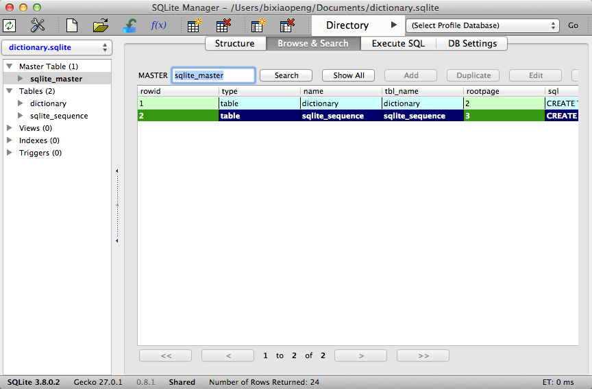

# 移动客户端上查看SQLITE数据


## 一. Android 查看SQLITE

测试项目:http://blog.csdn.net/wirelessqa/article/details/8583101

1. android应用中sqlite存放路径:data/data/包名/databases/数据库名.db
2. 要求有root权限


```
#进入手机
bixiaopeng@bixiaopengtekiMacBook-Pro ~$ adb shell
#获取root权限
shell@android:/ $ su
#进入应用的databases目录
shell@android:/ # cd data/data/com.wirelessqa.sqlite/databases/
shell@android:/data/data/com.wirelessqa.sqlite/databases # ls
wirelessqa.db
wirelessqa.db-journal
lessqa.db                                                                     <
SQLite version 3.7.11 2012-03-20 11:35:50
Enter ".help" for instructions
Enter SQL statements terminated with a ";"
sqlite> .tables
android_metadata  info
sqlite> select * from info;
1|bixiaopeng|22|blog.csdn.net/wirelessqa|weibo
sqlite>

```

## 二. iOS 查看SQLITE


1. 使用模拟器运行
2. 路径:/Users/bixiaopeng/Library/Application Support/iPhone Simulator/7.0.3/Applications/ios应用/Documents/数据库名.sqlite


```
bixiaopeng@bixiaopengtekiMacBook-Pro warehouse$ sqlite3 personinfo.sqlite
SQLite version 3.7.11 2012-03-20 11:35:50
Enter ".help" for instructions
Enter SQL statements terminated with a ";"
sqlite> .database
seq  name             file
---  ---------------  ----------------------------------------------------------
0    main             /Volumes/warehouse/personinfo.sqlite
sqlite> select * from PERSONINFO;
1|张三|23|西城区
2|老六|20|东城区
```


## 三. 使用图文工具查看SQLITE

1. 安装 : Firefox -- 添加附件组件 -- 搜索SQL -- 选择安装SQLITE MANAGER 
2. 使用 : 工具 -- SQLITE MANAGER -- 打开.sqlite的文件 



----
####  微信公众帐号: wirelessqa 


#### 关于作者：

**作者:** 毕小朋 | 老 毕  **邮箱:** <wirelessqa.me@gmail.com> 

**微博:** [@WirelessQA](http://www.weibo.com/wirelessqa) **博客:** <http://blog.csdn.net/wirelessqa>

----