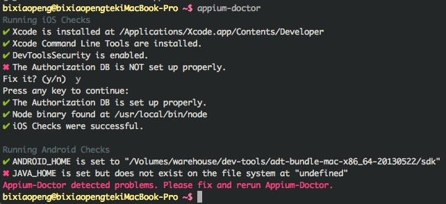
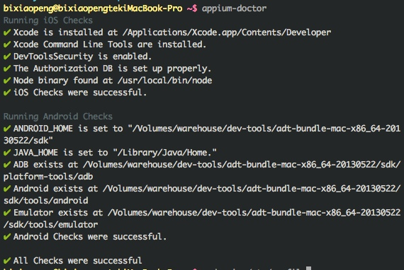
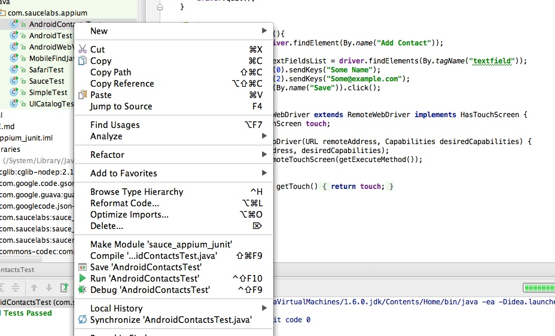

## 1. 安装、启动Appium

```
bixiaopeng@bixiaopeng ~$ npm install -g appium
Password:
npm http GET https://registry.npmjs.org/appium
npm http 200 https://registry.npmjs.org/appium
npm http GET https://registry.npmjs.org/appium/-/appium-0.15.0.tgz
npm http 200 https://registry.npmjs.org/appium/-/appium-0.15.0.tgz
………..此处省略N多字

├── swig@1.1.0 (optimist@0.6.0, uglify-js@2.4.0)
├── express@3.4.8 (methods@0.1.0, merge-descriptors@0.0.1, cookie-signature@1.0.1, range-parser@0.0.4, fresh@0.2.0, debug@0.7.4, buffer-crc32@0.2.1, cookie@0.1.0, send@0.1.4, commander@1.3.2, connect@2.12.0)
├── socket.io@0.9.16 (base64id@0.1.0, policyfile@0.0.4, redis@0.7.3, socket.io-client@0.9.16)
└── ws@0.4.31 (tinycolor@0.0.1, options@0.0.5, commander@0.6.1, nan@0.3.2)
```

```
bixiaopeng@bixiaopeng ~$ npm install wd
npm http GET https://registry.npmjs.org/wd
npm http 200 https://registry.npmjs.org/wd

………..此处省略N多字
```

```
bixiaopeng@bixiaopengtekiMacBook-Pro ~$  appium & 
```

## 2. 检查环境，使用命令appium-doctor



出现上面的问题解决办法：

```
bixiaopeng@bixiaopengtekiMacBook-Pro ~$ sudo vim /etc/profile
添加： 
export JAVA_HOME=/Library/Java/Home 
```



## 3.运行测试用例


测试JAVA用例：

1. 安装apps/ContactManager/ContactManagers.spk 

2. 导入idea — 环境配置成功后  — 右点选中AndroidContactsTest — Run'AndroidContactsTest'




####  微信公众帐号: wirelessqa 


#### 关于作者：

**作者:** 毕小朋 | 老 毕  **邮箱:** <wirelessqa.me@gmail.com> 

**微博:** [@WirelessQA](http://www.weibo.com/wirelessqa) **博客:** <http://blog.csdn.net/wirelessqa>