## 写在前面

研究iOS的自动化测试也有些日子了，刚开始的时候，一直苦于找不到什么好的资料，只能从Apple的官网查阅相关的API文档，只可惜，Apple对开发者来说实在是不怎么友好，文档写得相当的粗略，对于初学者来说有一定的难度。

本来是打算自己动手写一篇关于iOS的UI自动化测试的入门级别的介绍性文档的，但想起来后面在具体解决一些问题的时候，收藏一篇很好的Blog，很全面地介绍了如何使用UIAutomation的[JavaScript Libraries](https://developer.apple.com/library/ios/documentation/DeveloperTools/Reference/UIAutomationRef/_index.html)做iOS程序的自动化测试。如果作者早点看到这篇文章，应该要少走一些弯路，这里没有创意性的它他翻译成中文，希望对你们有一些帮助。

原文地址：<http://blog.manbolo.com/2012/04/08/ios-automated-tests-with-uiautomation>

翻译正文：

## 快速入门

自动化测试代码可以“在你的睡着的时候”很好地帮你测试你的应用程序。它可以让你能够快速地跟踪你程序中的回归和性能方面的问题，这样你就不用担心你新增的功能会影响到你之前已经完成开发的程序了。

随着iOS4.0的发布，苹果公司同时发布了一个名为UIAutomation的测试框架，它可以用来在真实设备和iPhone模拟器上执行自动化测试。但官方关于UIAutomation的文档相当的有限，在网络上也没有太多的资源可以查找的。本文将向你展示你如何将UIAutomation整合到你的工作流程当中去。

作为基础知识的准备，你可以先看一下苹果公司[关于UIAutomation](https://developer.apple.com/library/ios/documentation/DeveloperTools/Reference/UIAutomationRef/_index.html)的文档，另外还有一篇快速入门的介绍苹果[Instruments](https://developer.apple.com/library/ios/documentation/DeveloperTools/Conceptual/InstrumentsUserGuide/Introduction/Introduction.html)的文档也值得看看，当然，如果你有一个免费的Apple开发者账号的话，你可以看一下WWDC 2010 - Session 306 – 使用Instruments进行用户界面自动化测试的幻灯片或者视频。

除此之外，包括在Xcode中的OCUnit测试框架也可以用来为你的应用程序编写单元测试。

## 目录

```

1. 第一个UIAutomation测试脚本

使用iOS 模拟器
使用iOS设备
2. 处理UIAElement和元素可访问性（Accessibility）

UIAElement层次结构
模拟用户操作
3. 经验分享（让你的生活变得更简单）

类库Tune-up介绍
导入外部脚本
使用强大的命令行
使用录制交互功能
当遇到问题时，加上“UIATarget.delay(1);”
4. 高级交互

处理非预期和预期的提示框（alerts）
多任务
屏幕方向
5. 总结

有用的链接
一个视频

```

## 1. 你的第一个UIAutomation测试脚本

UIAutomation的功能测试代码是用Javascript编写的。UIAutomation和Accessibility有着直接的关系，你将用到通过标签和值的访问性来获得UI元素，同时完成相应的交互操作。

下面让我们来编写我们的第一段测试代码。

### 使用iOS模拟器

1. 下载示例应用程序TestAutomation.xcodeproj，并打开它。这个项目是一个很简单的包含2个tab的tabbar应用程序。

2. 确保选中如下图所示的“TestAutomation > iPhone 5.0 Simulator”模式（或许你已经切换成5.1了，因此它可能是iPhone5.1模拟器）。
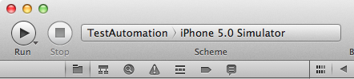

3. 启动Instruments(Product > Profile)，或者通过⌘I。

4. 选择左边的iOS Simulator，然后再选择Automation模板，然后点击“Profile”。
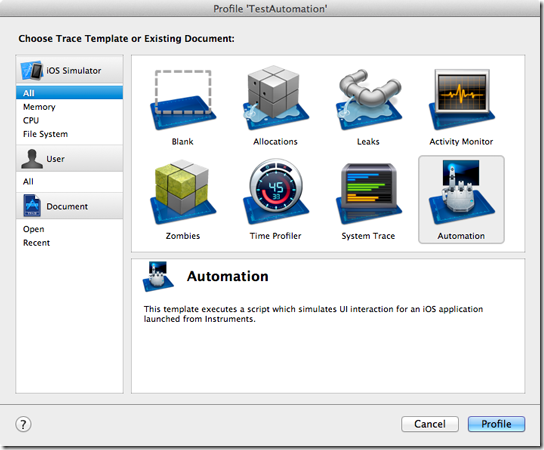
5. Instruments就已经启动好后，然后直接开始录制了。这里先停止录制，（红包按钮或者⌘R）。
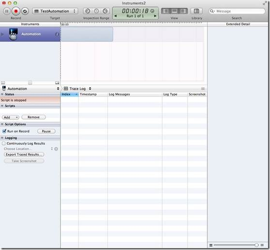
6. 在左边的Scripts窗口，点击“Add > Create”创建新的脚本。

7. 在脚本编辑器里，输入下面的代码

```
var target = UIATarget.localTarget();
var app = target.frontMostApp();
var window = app.mainWindow();
target.logElementTree();
```
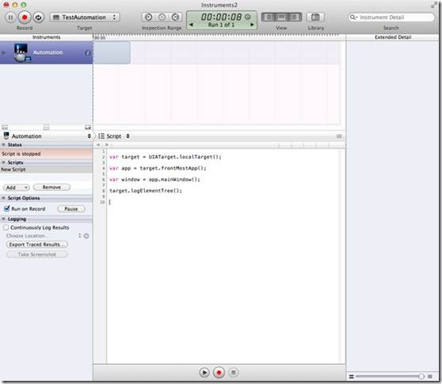

8.重新运行这段脚本⌘R（不需要保存）。脚本跑起来后，你可以在日志打完后停止它。
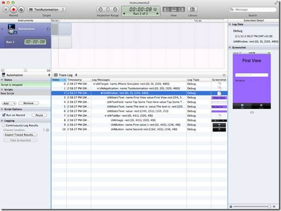

赞一个！我们就这样完成了我们的第一个UIAutomation测试用例。

### 使用iOS设备

你除了将你的测试用例运行模拟器上，也可以将它运行在一个真实的设备上。不过，自动化测试用例只能运行在支持多任务的：iPhone 3GS，iPad，iOS > 4.0等设备上。遗憾的是不管iPhone 3G的系统版本是什么，都不支持。

下面是如何操作：

1. 通过USB接口连接上你的iPhone。

2. 选择 “TestAutomation > iOS Device”模式。

3. 确保Developper profile设置成Release模式（而不是Ad-Hoc Distribution profile）。默认情况下，profiling是设置成Release模式的（因为没有必要将profile设置成Debug模式）。
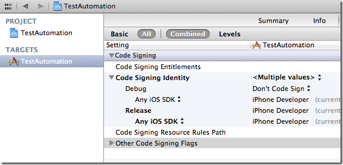

4. 启动测试 (⌘I)

5. 后面的步骤请参考前面模拟器部分。

 

## 2. 处理UIAElement和元素可访问性（Accessibility）

### UIAElement层次结构

Accessibility和UIAutomation有密切的联系：如果一个控件的Accessibility是可以被访问的，你就可以设置和读取它的值，作相关的操作，而当一个控件的Accessibility不可见时，你就没有办法通过automation访问它。

你可以通过Interface Builder，或者通过在程序里设置isAccessibilityElement属性的方式来设置一个控件的Accessibility或者可被自动化。当你设置container view（即：一个视图包含其它的UIKit元素）的accessibility时，你必须注意。你设置了整个View的accessibility将会“隐藏”它的子视图的accessibility，例如：在示例项目中，你不能将outlet视图设置成可访问的，否则它所有的子控件将都不可以访问了。在任何时候，logElementTree都是你忠实的朋友：它将当前界面的所有可被访问的元素都打印在日志里。

每一个可以被访问的UIKit控件都可以用一个Javascript对象来描述，它就是一个UIAElement。UIAElement有几个属性：name, value, elements, parent。你的主窗口包含很多的控件，它们是以UIKit层次的方式定义的，这些UIKit层次结构对应的是UIAElement的层次树。例如：前面的测试代码中，通过调用logElementTree，我们可以得到如下面所示的树结构：

+- UIATarget: name:iPhone Simulator rect:{{0,0},{320,480}}

| +- UIAApplication: name:TestAutomation rect:{{0,20},{320,460}}

| | +- UIAWindow: rect:{{0,0},{320,480}}

| | | +- UIAStaticText: name:First View value:First View rect:{{54,52},{212,43}}

| | | +- UIATextField: name:User Text value:Tap Some Text Here ! rect:{{20,179},{280,31}}

| | | +- UIAStaticText: name:The text is: value:The text is: rect:{{20,231},{112,21}}

| | | +- UIAStaticText: value: rect:{{145,231},{155,21}}

| | | +- UIATabBar: rect:{{0,431},{320,49}}

| | | | +- UIAImage: rect:{{0,431},{320,49}}

| | | | +- UIAButton: name:First value:1 rect:{{2,432},{156,48}}

| | | | +- UIAButton: name:Second rect:{{162,432},{156,48}}

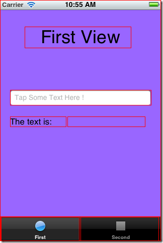


你可以通过下面的代码来访问文本框：

```
var textField = 
UIATarget.localTarget().frontMostApp().mainWindow().textFields()[0];
```

你可以选择通过从0开始的索引或者这个元素的名称来访问这个元素，例如：你也可以通过下面的代码来访问文本控件。

```
var textField = 
UIATarget.localTarget().frontMostApp().mainWindow().textFields()["User Text"];
```

后一种方式更加清晰明了，应该多使用。你可以通过Interface Builder设置UIAElement的name属性，
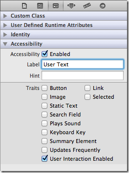

或者通过编写代码的方式：

```
myTextField.accessibilityEnabled = YES;
myTextField.accessibilityLabel = @"User Text";
```

你现在可以看到，通过accessibility属性可以被UIAutomation用来找到不同的控件。这非常的清晰，因为，第一，你只要学习一个测试框架；第二，通过编写自动化测试代码，你同时还可以保证你的程序是可以被访问的。因此，每一个UIAElement对象的子控件可以通过下面的方法进行访问：

buttons(), images(), scrollViews(),textFields(), webViews(), segmentedControls(), sliders(), staticTexts(), switches(), tabBar(),tableViews(), textViews(), toolbar(), toolbars() 等等……

你可以通过如下代码在tabbar上访问第一个tab：

```
var tabBar = UIATarget.localTarget().frontMostApp().tabBar();
var tabButton = tabBar.buttons()["First"];
```

UIAElement结构层次非常的重要，你以后会常常用到它。而且你还要记住，你可以在随时通过调用UIAAplication的logElementTree来获得它的结构。

```
UIATarget.localTarget().frontMostApp().logElementTree();
```

在模拟器上，你还可以激活Accessibility 的检测器。启动模拟器，找到“Settings > General > Accessibility > Accessibility Inspector”，然后将它设为“打开”状态。

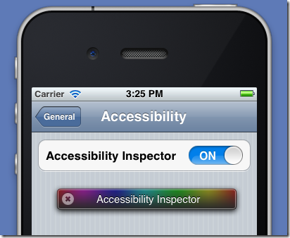

这个彩色的小框框就是Accessibility 检测器了。当它收起来的时候，Accessibility就被关闭了，当它展开的时候，Accessibility就是打开的。你只要点击上面的箭头按钮就可以激活或者屏蔽Accessibility。现在，打开我们的示例程序，激活检测器。
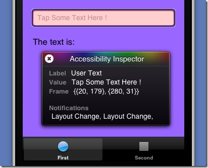

然后，点击文本框，检查UIAElement的name和value属性（其实就是accessibilityLabel和accessibilityValue对应的NSObject类型的值）。这个检测器可以帮助你调试和编写你的测试代码。

## 模拟用户操作

让我们更进一步，模拟一些用户的交互操作。你可以简单地调用按钮的tap()来作一个点击操作：

```
var tabBar = UIATarget.localTarget().frontMostApp().tabBar();
var tabButton = tabBar.buttons()["First"];   
 
// Tap the tab bar !
tabButton.tap();
```

你还可以调用UIAButtons的doubleTap(), twoFingerTap()。如果你不想操作具体的某个元素，你也可以直接根据屏幕上指定的坐标点进行操作，你可以这么用：

### 点击:

```
UIATarget.localTarget().tap({x:100, y:200});
UIATarget.localTarget().doubleTap({x:100, y:200});
UIATarget.localTarget().twoFingerTap({x:100, y:200});
```
### 缩放:

```
UIATarget.localTarget().pinchOpenFromToForDuration({x:20, y:200},{x:300, y:200},2);
UIATarget.localTarget().pinchCloseFromToForDuration({x:20, y:200}, {x:300, y:200},2);
```

### 拖拽与划动:

```
UIATarget.localTarget().dragFromToForDuration({x:160, y:200},{x:160,y:400},1);
UIATarget.localTarget().flickFromTo({x:160, y:200},{x:160, y:400});
```

注意，当你指定操作的时间间隔的时候，它是有特定的范围的，即：拖拽操作的时间间隔必须大于或者等于0.5秒，小于60秒。

### 现在，让我们来练习一下：

停止Instruments (⌘R)

在Scripts窗口里, 移除当前的脚本

点击“Add > Import”然后选择TestAutomation/TestUI/Test-1.js（将下面的代码保存到这个路径）

点击录制按钮 (⌘R) 然后看看将会发生什么…

下面是Test-1.js代码：

```
var testName = "Test 1";
var target = UIATarget.localTarget();
var app = target.frontMostApp();
var window = app.mainWindow();
UIALogger.logStart( testName );
app.logElementTree();
//-- select the elements
UIALogger.logMessage( "Select the first tab" );
var tabBar = app.tabBar();
var selectedTabName = tabBar.selectedButton().name();
if (selectedTabName != "First") {
    tabBar.buttons()["First"].tap();
}
//-- tap on the text fiels
UIALogger.logMessage( "Tap on the text field now" );
var recipeName = "Unusually Long Name for a Recipe";
window.textFields()[0].setValue(recipeName);
target.delay( 2 );
//-- tap on the text fiels
UIALogger.logMessage( "Dismiss the keyboard" );
app.logElementTree();
app.keyboard().buttons()["return"].tap();
var textValue = window.staticTexts()["RecipeName"].value();
if (textValue === recipeName){
    UIALogger.logPass( testName ); 
}
else{
    UIALogger.logFail( testName ); 
}
```

这段脚本先启动待测程序，然后，如果第一个tab没有被选的话就切换到第一个tab，并将上面的文本框的值设成“Unusually Long Name for a Recipe”，接着收起虚拟键盘。这里有一些新的方法值得注意的：UIATarget的delay(Number timeInterval) 方法允许你在两个操作之间做一些等待，UIALogger的logMessage( String message) 方法用来将你想打印的信息输出到日志上去，UIALogger的logPass(String message)方法指明你的测试脚本已经成功的完成测试了。

你还知道了如何访问键盘上的按钮，然后作点击操作：

```
app.keyboard().buttons()["return"].tap();
```


## 3. 经验分享（让你生活变得更简单）

### 类库Tune-up介绍

现在你应该基本上知道如何编写测试代码了。但你慢慢地会发现，你会经常写到一些重复的，冗余的，黏糊糊的代码，像下面一样：

```
var target = UIATarget.localTarget();
var app = target.frontMostApp();
var window = app.mainWindow();
```

这也是为什么我们会用到一个小的Javascript类库来简化我们写的UIAutomation测试的原因。你可以去 https://github.com/alexvollmer/tuneup_js获取这个类库，然后将它复制到你的测试目录下面。

现在让我们使用Tune-Up类库来重新编写我们的Test1.js：

```
#import "tuneup/tuneup.js"
 
test("Test 1", function(target, app) {
    var window = app.mainWindow();
    app.logElementTree();
 
    //-- select the elements
    UIALogger.logMessage( "Select the first tab" );
    var tabBar = app.tabBar();
    var selectedTabName = tabBar.selectedButton().name();
 
    if (selectedTabName != "First") {
        tabBar.buttons()["First"].tap();
    }
 
    //-- tap on the text fiels
    UIALogger.logMessage( "Tap on the text field now" );
    var recipeName = "Unusually Long Name for a Recipe";
    window.textFields()[0].setValue(recipeName);
    target.delay( 2 );
 
    //-- tap on the text fiels
    UIALogger.logMessage( "Dismiss the keyboard" );
    app.logElementTree();
    app.keyboard().buttons()["return"].tap();
    var textValue = window.staticTexts()["RecipeName"].value();
    assertEquals(recipeName, textValue);
});
```

Tune-Up可以避免你编写重复的代码，同时还给你提供了各种好用的断言方法：

```
ssertTrue(expression, message),
assertMatch(regExp, expression, message),
assertEquals(expected, received, message),
assertFalse(expression, message),
assertNull(thingie, message),
assertNotNull(thingie, message),
assertNull(thingie, message),
assertNotNull(thingie, message)
```

等等

你也可以很容易的扩展这个类库：例如，你可以通过将方法加入到uiautomation-ext.js:里面来为UIATarget类加一个logDevice方法：

```
extend(UIATarget.prototype, {
        logDevice: function(){
        UIALogger.logMessage("Dump Device:");
        UIALogger.logMessage(" model: " + UIATarget.localTarget().model());
        UIALogger.logMessage(" rect: " + JSON.stringify(UIATarget.localTarget().rect()));
        UIALogger.logMessage(" name: "+ UIATarget.localTarget().name());
        UIALogger.logMessage(" systemName: "+ UIATarget.localTarget().systemName());
        UIALogger.logMessage(" systemVersion: "+ UIATarget.localTarget().systemVersion());
    }
});
```

然后当你调用target.logDevice()就可以看到：

```
Dump Device:
model: iPhone Simulator
rect: {"origin":{"x":0,"y":0},"size":{"width":320,"height":480}}
name: iPhone Simulator
```

### 导入外部脚本

你也可以看到如何在一个脚本文件里引用另一个脚本，即通过#import指令。因此，你可以创建多个测试文件，然后将它们通过导入到单个文件的方式来链接并调用它们：

```
#import "Test1.js"
#import "Test2.js"
#import "Test3.js"
#import "Test4.js"
#import "Test5.js"
```

### 使用强大的命令行

如果你想让你的测试代码自动的运行起来，你还可以通过命令行来启动测试。其实，我比较推荐这种方式，而不是使用Instruments的图形界面程序。因为，Instruments的图形界面程序比较慢，而且即使你的测试代码跑完了它也还是会一直运行着。而通过命令行来启动和运行测试代码更快，它会在跑完测试后自动的停止。

为了可以在命令行终端运行你的脚本，你需要知道你设备的UDID和类型：

```
instruments -w your_ios_udid -t 
/Applications/Xcode.app/Contents/Developer/Platforms/iPhoneOS.platform/Developer/Library/Instruments/PlugIns/AutomationInstrument.bundle/Contents/Resources/Automation.tracetemplate 
name_of_your_app -e UIASCRIPT absolute_path_to_the_test_file
```

例如，使用我自己的机子，就这么写的：

```
instruments -w a2de620d4fc33e91f1f2f8a8cb0841d2xxxxxxxx -t 
/Applications/Xcode.app/Contents/Developer/Platforms/iPhoneOS.platform/Developer/Library/Instruments/PlugIns/AutomationInstrument.bundle/Contents/Resources/Automation.tracetemplate 
TestAutomation -e UIASCRIPT 
/Users/jc/Documents/Dev/TestAutomation/TestAutomation/TestUI/Test-2.js
```


如果你使用的Xcode版本低于4.3的话，你需要这样写：

```
instruments -w your_ios_device_udid -t /Developer/Platforms/iPhoneOS.platform/Developer/Library/Instruments/PlugIns/AutomationInstrument.bundle/Contents/Resources/Automation.tracetemplate TestAutomation -e UIASCRIPT /Users/jc/Documents/Dev/TestAutomation/TestAutomation/TestUI/Test-2.js
```

一个小提示，不要忘了关闭你设备的密码验证，否则你会看到这样的日志信息的：remote exception encountered : ’device locked : Failed to launch process with bundle identifier ’com.manbolo.testautomation’. 的确，因为UIAutomation根本不知道你的密码啊。

命令行终端同样可以在模拟器上使用，但你需要知道待测应用程序在文件系统中的绝对路径。模拟器将目录~/Library/Application Support/iPhone Simulator/5.1/ “模拟”成了设备的文件系统。在这个目录下，你可以找到一个包含装在模拟器上的所有应用程序的沙盒的Applications文件夹。定位到TestAutomation程序的目录，然后：

```
instruments -t /Applications/Xcode.app/Contents/Developer/Platforms/iPhoneOS.platform/Developer/Library/Instruments/PlugIns/AutomationInstrument.bundle/Contents/Resources/Automation.tracetemplate "/Users/jc/Library/Application Support/iPhone Simulator/5.1/Applications/C28DDC1B-810E-43BD-A0E7-C16A680D8E15/TestAutomation.app" -e UIASCRIPT /Users/jc/Documents/Dev/TestAutomation/TestAutomation/TestUI/Test-2.js
```

最后，如果你没有指定日志输入到哪里的话，你的测试结果会被放到你命令行当前指定（工作）的目录下。你可以通过加入 -e UIARESULTSPATH results_path 参数来指定日志输入目录。

我没有成功的将多个测试脚本并行着在命令行中运行起来。但是你可以将你的测试脚本串连进来，有一整晚去跑它，这样就真正的实现了“在你睡着的时候”，就完成了对应用程序的测试。

### 使用录制交互功能

除了手动的编写脚本，你还可以直接在设备上或者模拟器上录制脚本，然后替换掉原来的。下面是步骤：

1. 启动Instruments (⌘I)

2. 创建一个新的脚本

3. 选择脚本编辑器
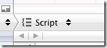
4. 在脚本编辑器的底端，你是否看到了一个红色的按钮？点击它！

5. 现在，你可以操作你的应用程序；你将看到录制的交互操作出现在脚本窗口（甚至旋转事件）。点击方形按钮来停止录制。
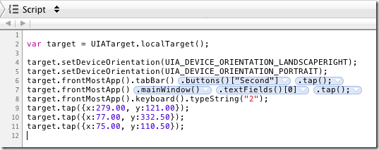

遇到问题时，加上“UIATarget.delay(1);”

当你在编写脚本的时候，你总是在与时间，动画打交道。UIAutomation有很多方式去获取控件元素，然后等待它们变为可用状态，即使有时候它们还没有显示出来，但根据这篇文档里提到的，最好的建议是：

当遇到问题时，加上UIATarget.delay(1);

## 4. 高级交互

### 处理非预期和预期的提示框（alerts）

在写自动化测试过程中，处理提示框是很难的一件事情：你已经很认真的写好了你的测试用例，然后在你准备睡觉之前将它跑起来，然后，到第二天早上，你发现你的测试用例被一个未知消息提示框给毁了。然而，UIAutomation帮助你处理了这种情况。

通过下面代码来实现：

```
UIATarget.onAlert = function onAlert(alert){
    var title = alert.name();
    UIALogger.logWarning("Alert with title ’" + title + "’ encountered!");
    return false; // use default handler
}
```

它返回一个false，UIAutomation会自动的帮你销毁UIAlertView窗口，因此提示框就不会再影响你的测试了。你的测试脚本就永远不会有提示框弹出了。但是提示框可能是你应用程序的一部分，涉及到你测试的流程，所以，有时候，你不希望它被自动的处理掉。这时，你可以根据提示框的标题来决定，点击某个按钮，然后返回true。通过返回true，你向UIAutomation指定这个提示框必须作为测试的一部分来考虑。

例如，如果你想当提示框的标题为“Add Something”时，点击“Add”按钮，你可以这么写：

```
UIATarget.onAlert = function onAlert(alert) {
    var title = alert.name();
    UIALogger.logWarning("Alert with title ’" + title + "’ encountered!");
    if (title == "Add Something") {
        alert.buttons()["Add"].tap();
        return true; // bypass default handler
    }
    return false; // use default handler
}
```


容易吧？

### 多任务

测试你的应用程序的多任务是非常容易的事：假设你想测试每次启动一个疯狂的后台进程，将程序放到后台执行,并进入(void)applicationWillEnterForeground:(UIApplication *)application选择器代码段，你可以通过下面的代码来将它推至后台，然后等待10秒后自动返回活动状态。.

UIATarget.localTarget().deactivateAppForDuration(10);

deactivateAppForDuration(duration) 方法会暂停测试脚本的执行，模拟用户点击Home按钮，（即将程序放到后台），等待，然后为你重新激活程序和测试脚本，就这么一行代码而已！

### 屏幕方向

最后，你可以模拟你的iPhone的旋转方向。也是很直观很简单：

```
var target = UIATarget.localTarget();
var app = target.frontMostApp();
// set landscape left
target.setDeviceOrientation(UIA_DEVICE_ORIENTATION_LANDSCAPELEFT);
UIALogger.logMessage("Current orientation is " + app.interfaceOrientation());
// portrait
target.setDeviceOrientation(UIA_DEVICE_ORIENTATION_PORTRAIT);
UIALogger.logMessage("Current orientation is " + app.interfaceOrientation());
```

## 5. 总结

有用的链接

这篇文章有点儿长，但我希望你们能见识到UIAutomation是很强大的，且你的应用程序是可以得到质量的保障的。网上没有太多的UIAutomation的资料，但我还是列出了很多链接，也许能帮到你。

http://cocoamanifest.net/articles/2011/05/uiautomation-an-introduction.html,http://cocoamanifest.net/articles/2011/07/ui-automation-part-2-assertions-and-imports.html 和 http://cocoamanifest.net/articles/2011/11/changes-to-ui-automation-in-ios-5.html: 非常好的UIAutomation系列的文章

http://mobilecoder.wordpress.com/2010/11/08/iphoneipodipad-automation-basics: 非常不错的UIAutomation教程，值得阅读！
http://www.juddsolutions.com/downloads/UnitAndFunctionalTestingForiOSPlatform.pdf: 很高深的单元测试和UI自动化测试的介绍。第70页里提到的“当遇到问题时，加上UIATarget.delay(1);!”会让你收获很大的。

http://guerratopia.com/en/introduction-to-automating-ui-testing-in-ios: 非常好的介绍教程
http://jojitsoriano.wordpress.com/2011/06/03/references-on-unit-testing-ui-automation-for-ios-applications: 很多关于单元测试和UI自动化测试的链接

当然还有：

Apple documentation on UIAutomation
UIAutomation in Apple Instruments documentation
WWDC 2010 - Session 306 - Automating User Interface Testing with Instruments
你需要一个免费的开发者账号去访问这些资源。

一个视频

在介绍完UIAutomation之后，我不反对向你们展示我们是如何使用在Meon中使用 UIAutomation的一段小视频。我们使用了各种测试，在这个视频中，我们测试了玩家可以从0级玩到120级。帮帮我，我的iPhone还活着呢！

http://player.vimeo.com/video/39888743?title=0&byline=0&portrait=0


转自:http://www.cnblogs.com/vowei/archive/2012/08/17/2644158.html