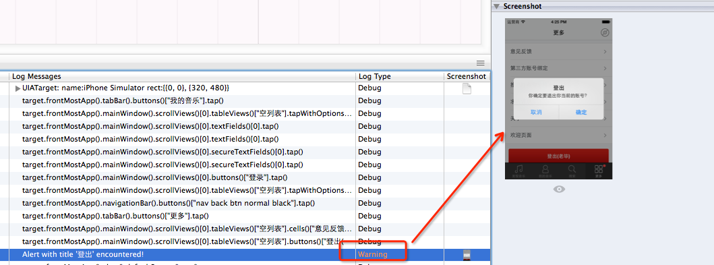

## UIALogger.logStart

UIALogger.logStart用于收起显示同一级的log。
使用logStart后，后续的log记录，都会标记为其子集，可收起、展开显示，直到遇到logPass、logFail、logIssue，才结束这一层级。

## 显示某个对象的所有属性

```
var target = UIATarget.localTarget();
var obj= target.frontMostApp().mainWindow().images()["QmenuBut3.png"].rect().origin;
var aaa="";
for(var i in obj) {
aaa = aaa +i+":"+obj[i]+" ";
}
UIALogger.logPass("obj:"+aaa);

```

## 如何处理alert对话框

### 需要注意:

1. UIATarget.onAlert事件要放在执行代码前面定义
2. UIATarget.onAlert事件中return值需要为true。如果是false，系统自动点击cancel按钮，如果cancel按钮不存在，则点击默认按钮。

### 码上举例:

```
target.frontMostApp().mainWindow().scrollViews()[0].tableViews()["空列表"].cells()["意见反馈"].scrollToVisible();
//判断alert事件
UIATarget.onAlert = function onAlert(alert) {
	var title = alert.name();
	UIALogger.logWarning("Alert with title ’" + title + "’ encountered!");
	if (title == "登出") {
	return true; 
}
	//如果是false，系统自动点击cancel按钮，如果cancel按钮不存在，则点击默认按钮
	return false; 
}
//点击后会弹出alert
target.frontMostApp().mainWindow().scrollViews()[0].tableViews()["空列表"].buttons()["登出(老毕)"].tap();
//执行alert点击事件
target.frontMostApp().alert().defaultButton().tap();
target.delay(2);

```
UIALogger.logWarning



## 常用处理

```
//调用外部js
#import “../common/common.js”

//导航栏操作
UIATarget.localTarget().frontMostApp().navigationBar().leftButton().tap(); //点击左侧按钮
UIATarget.localTarget().frontMostApp().navigationBar().rightButton().tap(); //点击右侧按钮

//按钮点击
UIATarget.localTarget().frontMostApp().mainWindow().buttons()["xxxxx"].tap();

//坐标点击
UIATarget.localTarget().tap({x:30,y:131});

//等待n秒，delay(n)
UIATarget.localTarget().delay(3);

//截图
UIATarget.localTarget().captureScreenWithName(“picname”);

//获取对象数组长度，length
UIATarget.localTarget().frontMostApp().mainWindow().buttons().length;

//获取文本字符串，value()
UIATarget.localTarget().frontMostApp().mainWindow().scrollViews()[0].staticTexts()[0].value();

//滚轮滚动，dragInsideWithOptions()
UIATarget.localTarget().frontMostApp().mainWindow().pickers()[0].wheels()[0].dragInsideWithOptions({startOffset:{x:0.38, y:0.66}, endOffset:{x:0.38, y:0.12}, duration:1.6});

//根据name模糊查询控件，firstWithPredicate(“name beginswith ‘xxx’”)
obj= window.tableViews()[0].cells().firstWithPredicate(“name beginswith ‘hello’”);

//根据name完全匹配，firstWithName(“xxxx”)
obj= window.tableViews()[0].cells().firstWithName(“hello world”);

//根据key值匹配，firstWithValueForKey(value,key)
obj= window.tableViews()[0].cells().firstWithValueForKey(“hello world”,”name”);

//拖动
window.tableViews()[0].scrollDown();
window.tableViews()[0].scrollUp();
window.tableViews()[0].scrollLeft();
window.tableViews()[0].scrollRight();

//打印当前屏幕所有空间信息
UIATarget.localTarget().logElementTree();

//记录日志
UIALogger.logStart(“start”);
UIALogger.logPass(“pass”);
UIALogger.logWarning(“warning”);
UIALogger.logFail(“fail”);
UIALogger.logMessage(“message”);
UIALogger.logError(“error”);
UIALogger.logDebug(“debug”);
UIALogger.logIssue(“issue”);

//九宫格搜索输入框
UIATarget.localTarget().frontMostApp().mainWindow().searchBars()[0]

//模拟键盘操作，keyboard().typeString(“xxx”)
UIATarget.localTarget().frontMostApp().keyboard().typeString(“aaa\n”);

\n=回车

//输入框输入，setValue()
UIATarget.localTarget().frontMostApp().mainWindow().tableViews()["Empty list"].cells()["用户名:"].textFields()[0].setValue(“abcd”);
```